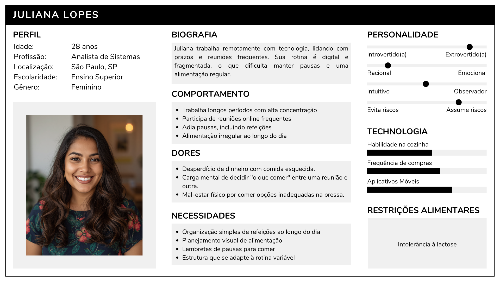
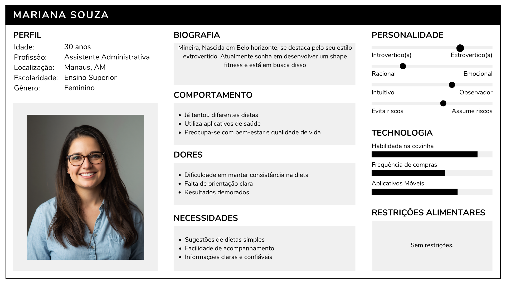
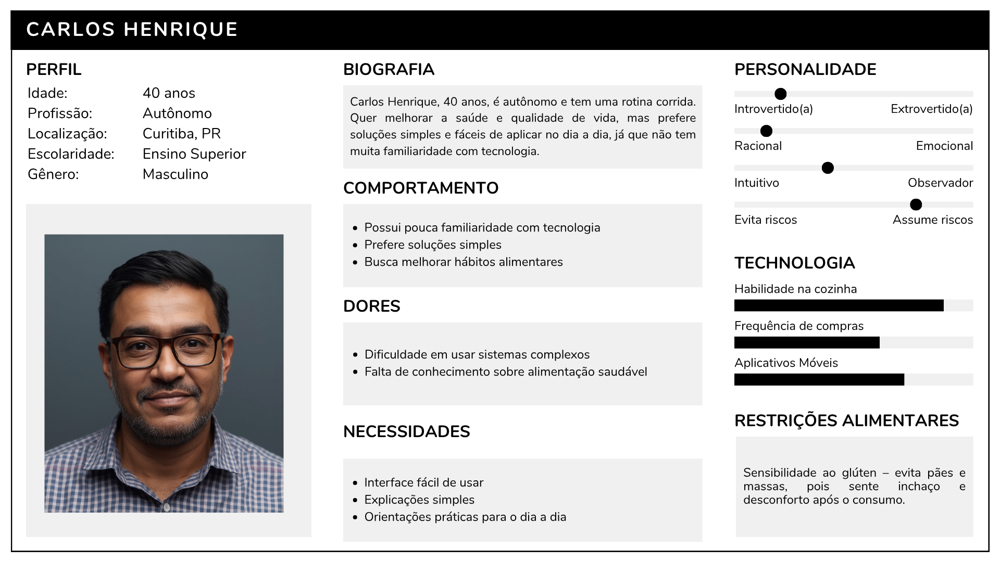
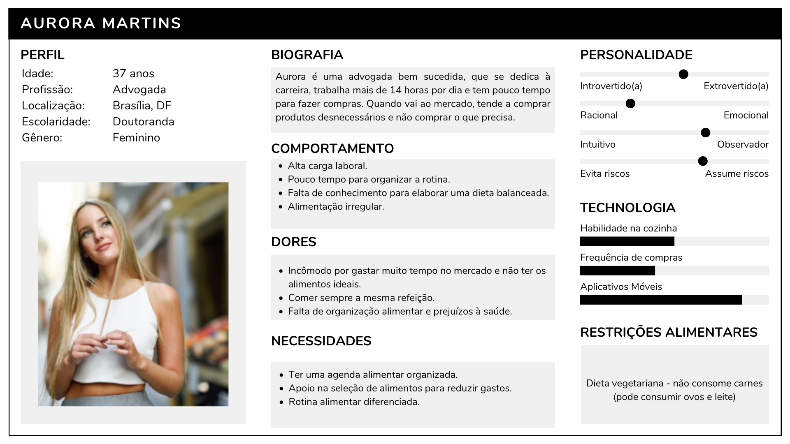
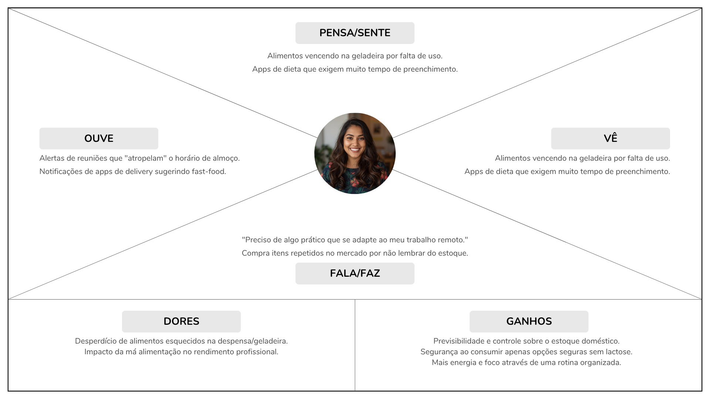
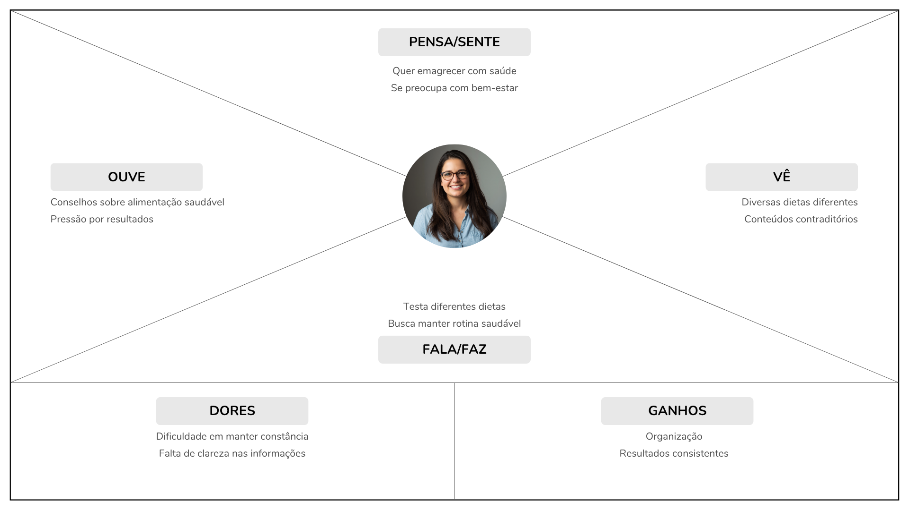
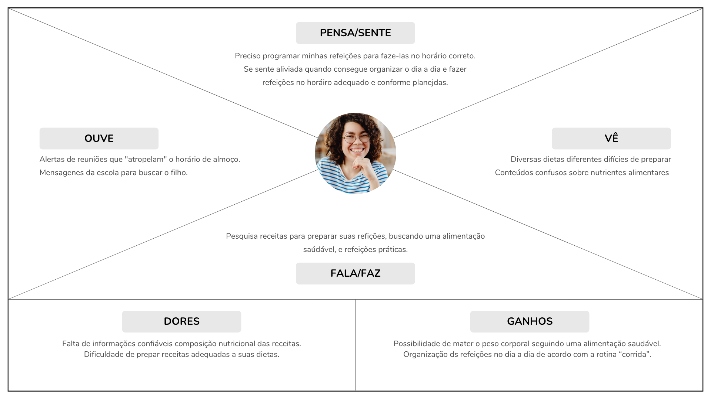
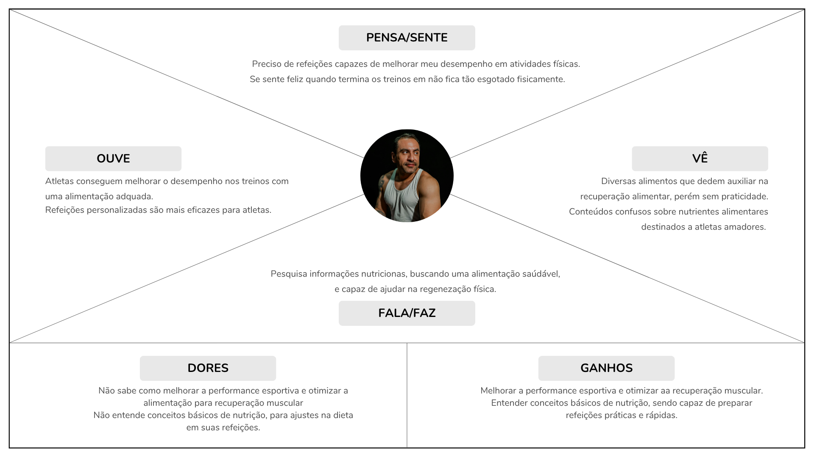
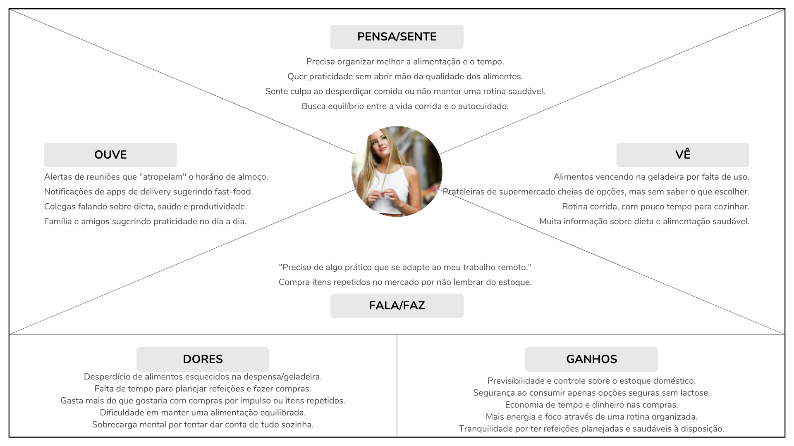

# 4. PROJETO DO DESIGN DE INTERAÇÃO

## 4.1 Personas

### Persona 1: Juliana Lopes

### Persona 2: Lucas Andrade

 

### Persona 3: Mariana Souza

 

### Persona 4: Carlos Henrique

 

### Persona 5: Amanda Santos

 

### Persona 6: Fernando Carvalho 

 

### Persona 7: Aurora Martins
 

## 4.2 Mapa de Empatia

### Persona 1: Juliana Lopes

 

### Persona 2: Lucas Andrade

 

### Persona 3: Mariana Souza

 

### Persona 4: Carlos Henrique

 

### Persona 5: Amanda Santos

### Persona 6: Fernando Carvalho

### Persona 7: Aurora Martins

## 4.3 Protótipos das Interfaces

Apresente nesta seção os protótipos de alta fidelidade do sistema proposto. A fidelidade do protótipo refere-se ao nível de detalhes e funcionalidades incorporadas a ele. Assim, um protótipo de alta fidelidade é uma representação interativa do produto, baseada no computador ou em dispositivos móveis. Esse protótipo já apresenta maior semelhança com o design final em termos de detalhes e funcionalidades. No desenvolvimento dos protótipos, devem ser considerados os princípios gestálticos, as recomendações ergonômicas e as regras de design (como as 8 regras de ouro). É importante descrever no texto do relatório como os princípios gestálticos e as regras de ouro foram seguidas no projeto das interfaces. Nesta etapa deve-se dar uma ênfase na implementação do software de modo que possam ser realizados os testes com usuários na etapa seguinte.

## 4.4 Testes com Protótipos

Nesta seção você deve apresentar os testes realizados com usuários utilizando os protótipos de alta fidelidade desenvolvidos na seção anterior. O objetivo é avaliar a usabilidade, a clareza das informações e a adequação do design às necessidades das personas definidas no projeto.

Cada integrante do grupo deverá aplicar o teste com um usuário distinto, preferencialmente alinhado ao perfil das personas criadas. Devem ser definidas previamente as tarefas que o usuário deverá executar no protótipo (por exemplo: realizar um cadastro, buscar um produto, concluir uma compra).

Durante a aplicação do teste, registre observações sobre comportamentos, dúvidas, erros e comentários feitos pelo usuário, bem como o tempo necessário para a execução de cada tarefa. Ao final, colete o feedback do participante, destacando pontos positivos e aspectos a serem melhorados.

Os resultados obtidos por todos os integrantes devem ser consolidados, apresentando uma análise geral com os principais problemas encontrados, oportunidades de melhoria e as ações previstas para o projeto final. 
Na descrição dos protótipos, atentem-se à organização de cada tela, contemplando:

- Objetivo da Tela
- Princípios Gestálticos
- Recomendações Ergonômicas
- Regras de Ouro

Sobre os testes de protótipos:

Uma prática recomendada é definir um conjunto padrão de perguntas para os usuários. Assim, cada integrante do grupo aplica as mesmas questões a um usuário diferente (um usuário por integrante), permitindo posteriormente a síntese dos resultados, conforme solicitado na seção 4.4 do relatório.

Segue um conjunto de perguntas sugeridas:

1 - Ao acessar a página inicial, você compreendeu rapidamente o objetivo do sistema? 
2 - O menu e os botões estão posicionados de forma intuitiva? 
3 - A nomenclatura das seções (menus, botões e links) é clara? 
4 - Foi fácil localizar as informações ou funcionalidades desejadas? 
5 - As etapas para realizar as tarefas estão claras e bem organizadas? 
6 - Os elementos visuais (cores, ícones e layout) ajudam a identificar o que é clicável? 
7 - Há elementos que geram confusão ou chamam atenção de forma inadequada? 
8 - Os textos e rótulos são claros e auxiliam na navegação? 
9 - Houve dificuldade para visualizar, clicar ou entender algum elemento? 
10 - As instruções e mensagens são compreensíveis? 
11 - Há termos técnicos ou expressões confusas? 
12 - Você se sentiu seguro(a) ao utilizar o protótipo, sem necessidade de ajuda? 
13 - O que você mais gostou na interface? 
14 - O que você melhoraria? 
15 - Gostaria de acrescentar mais algum comentário? 

Teste de Usabilidade com Usuário
Persona: Aurora Martins

A usuária foi convidada a realizar as seguintes tarefas: criar uma conta e fazer login.

Tarefa 1
Criar uma conta, o tempo foi 1 min 10s, tendo concluído com sucesso. Aurora encontrou facilmente o botão “Novo usuário” e entendeu que o formulário é simples e direto, mas o botão poderia estar mais destacado.

Feedback da usuária (Aurora Martins)
Pontos positivos:
Interface simples e organizada
Funcionalidades úteis para o dia a dia
Boa estrutura geral do sistema

Dificuldades:
Botões pouco destacados
Com base no teste realizado, foi possível identificar:

O sistema BeFit apresenta uma boa base de usabilidade e atende às necessidades da persona Aurora Martins. No entanto, melhorias na clareza das informações e na hierarquia visual são necessárias para tornar a experiência mais intuitiva e eficiente.

