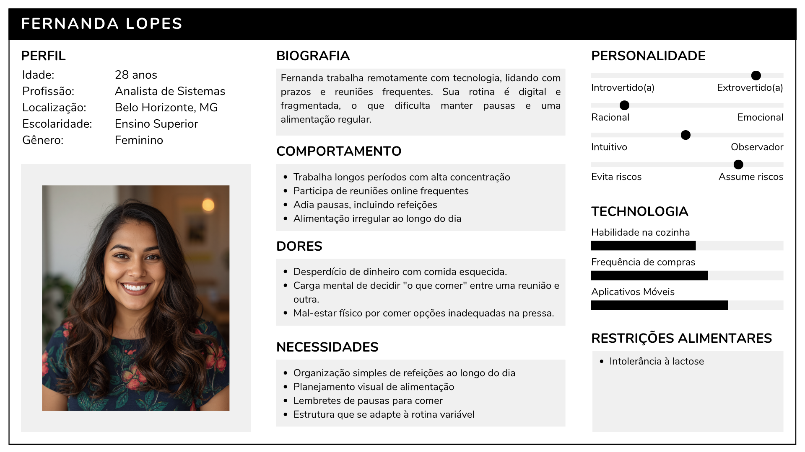
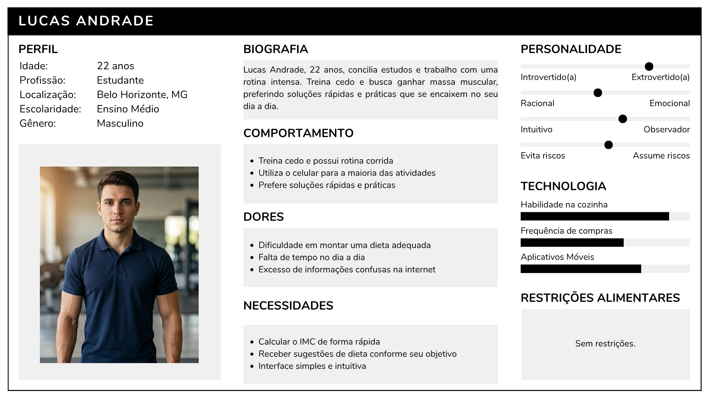
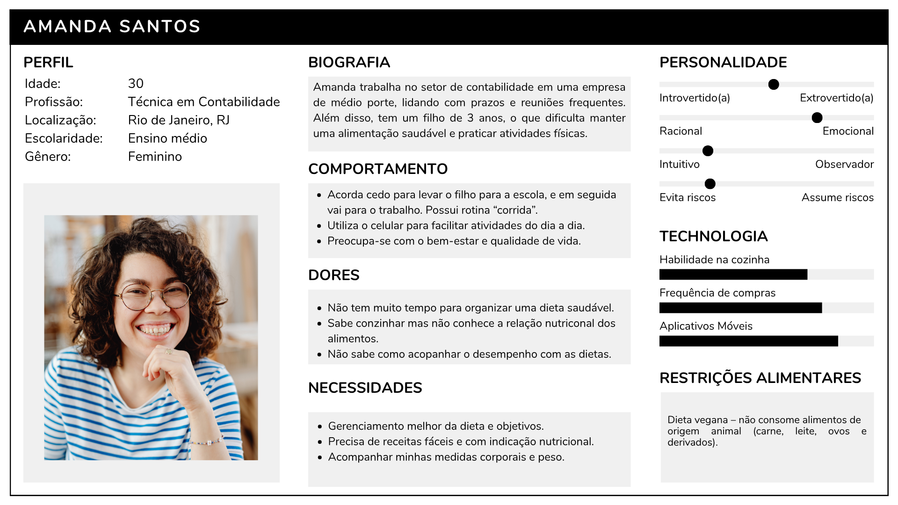
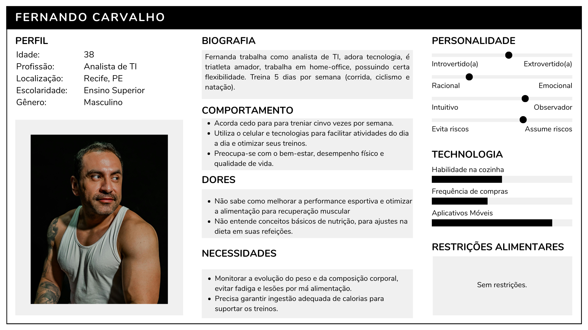
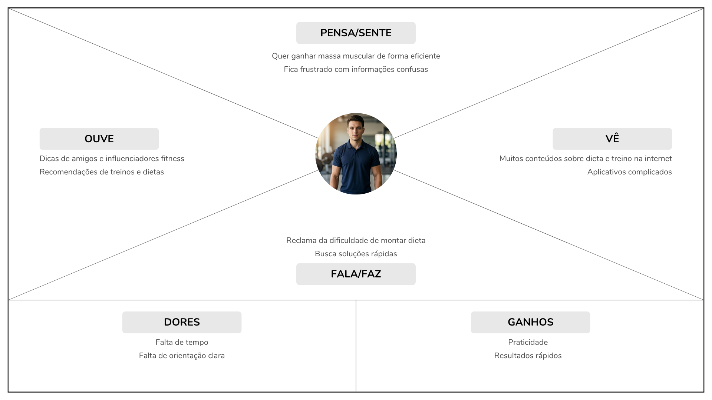
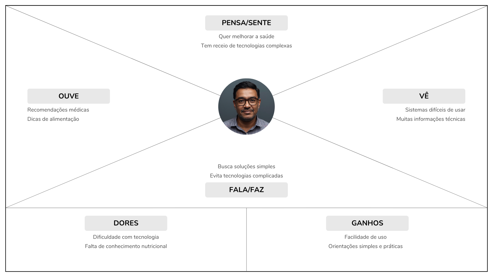
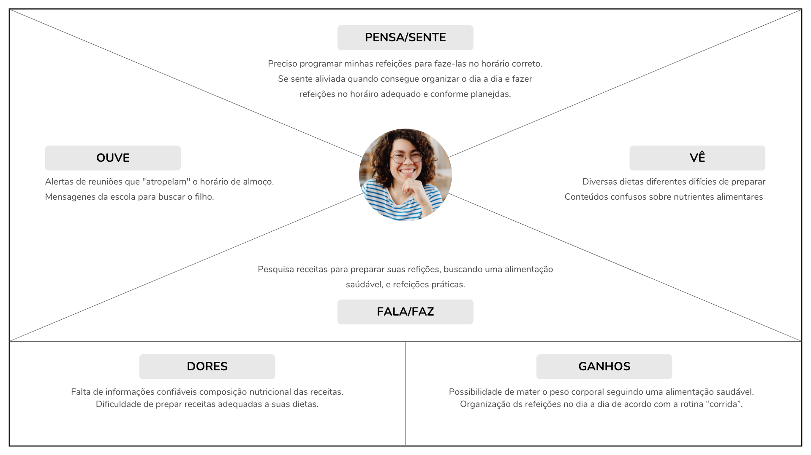

# 4. PROJETO DO DESIGN DE INTERAÇÃO

## 4.1 Personas

### Persona 1: Juliana Lopes

### Persona 2: Lucas Andrade

 

### Persona 3: Mariana Souza

 

### Persona 4: Carlos Henrique

 

### Persona 5: Amanda Santos

 

### Persona 6: Fernando Carvalho 

 

### Persona 7: Aurora Martins

## 4.2 Mapa de Empatia

### Persona 1: Juliana Lopes

 

### Persona 2: Lucas Andrade

 

### Persona 3: Mariana Souza

 

### Persona 4: Carlos Henrique

 

### Persona 5: Amanda Santos

### Persona 6: Fernando Carvalho

### Persona 7: Aurora Martins

## 4.3 Protótipos das Interfaces

## 4.4 Testes com Protótipos

Teste de Usabilidade com Usuário
Persona: Aurora Martins

Nome: Aurora Martins
Idade: 27 anos
Perfil: Jovem profissional preocupada com saúde e alimentação equilibrada, com rotina ocupada e pouco tempo para planejar refeições.

Tarefas propostas

A usuária foi convidada a realizar as seguintes tarefas: criar uma conta e fazer login.

Criar uma conta
Tempo: 1 min 10s
Resultado: Concluído com sucesso

Observações:
Aurora encontrou facilmente o botão “Novo usuário”. O formulário é simples e direto.

Problema:
Nenhuma indicação visual de erro ou validação de campos.

Tarefa 2: Login
Tempo: 40s
Resultado: Concluído
Observações:
Interface clara e objetiva.
Problema:
O botão poderia estar mais destacado.

Feedback da usuária (Aurora Martins)

Pontos positivos:
Interface simples e organizada
Funcionalidades úteis para o dia a dia
Boa estrutura geral do sistema

Dificuldades:
Botões pouco destacados
Com base no teste realizado, foi possível identificar:

O sistema BeFit apresenta uma boa base de usabilidade e atende às necessidades da persona Aurora Martins. No entanto, melhorias na clareza das informações e na hierarquia visual são necessárias para tornar a experiência mais intuitiva e eficiente.

EXPLICAÇÃO SOBRE ESSA PARTE : 

Nesta seção você deve apresentar os testes realizados com usuários utilizando os protótipos de alta fidelidade desenvolvidos na seção anterior. O objetivo é avaliar a usabilidade, a clareza das informações e a adequação do design às necessidades das personas definidas no projeto.

Cada integrante do grupo deverá aplicar o teste com um usuário distinto, preferencialmente alinhado ao perfil das personas criadas. Devem ser definidas previamente as tarefas que o usuário deverá executar no protótipo (por exemplo: realizar um cadastro, buscar um produto, concluir uma compra).

Durante a aplicação do teste, registre observações sobre comportamentos, dúvidas, erros e comentários feitos pelo usuário, bem como o tempo necessário para a execução de cada tarefa. Ao final, colete o feedback do participante, destacando pontos positivos e aspectos a serem melhorados.

Os resultados obtidos por todos os integrantes devem ser consolidados, apresentando uma análise geral com os principais problemas encontrados, oportunidades de melhoria e as ações previstas para o projeto final. 
