# 4. PROJETO DO DESIGN DE INTERAÇÃO

## 4.1 Personas

### Persona 1: Juliana Lopes

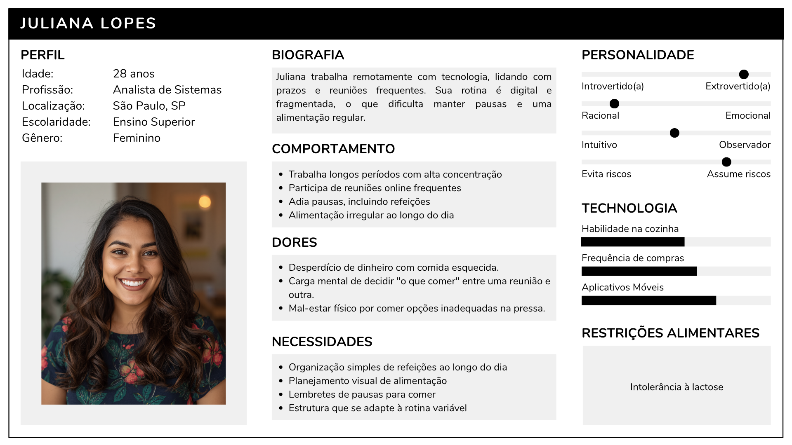

### Persona 2: Lucas Andrade

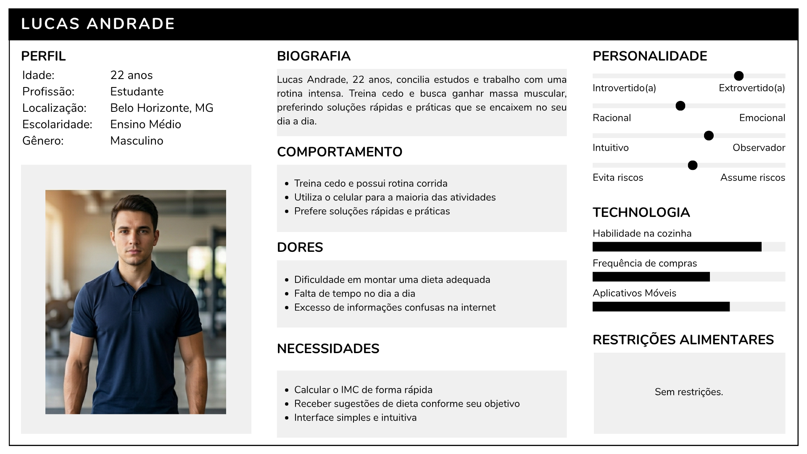 

### Persona 3: Mariana Souza

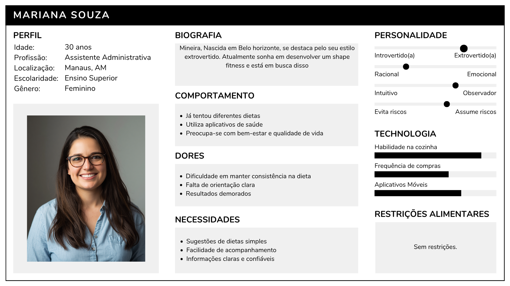 

### Persona 4: Amanda Santos

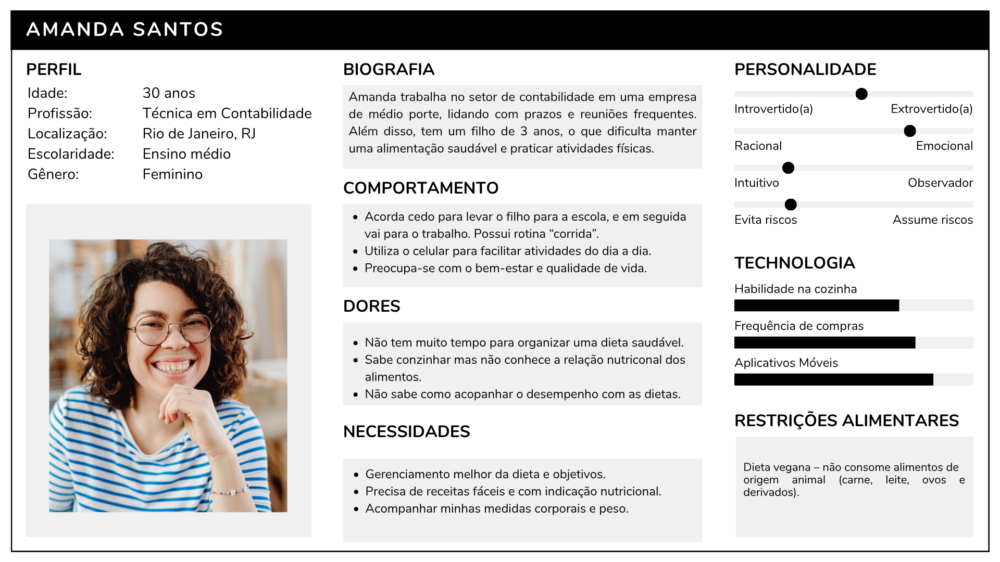 

### Persona 5: Fernando Carvalho 

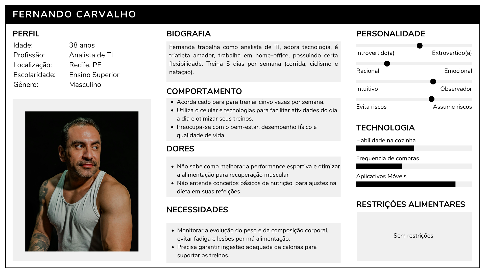 

### Persona 6: Aurora Martins
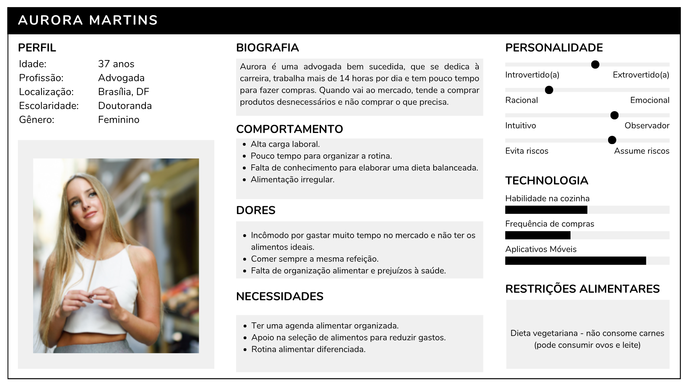 

---

## 4.2 Mapa de Empatia

### Persona 1: Juliana Lopes

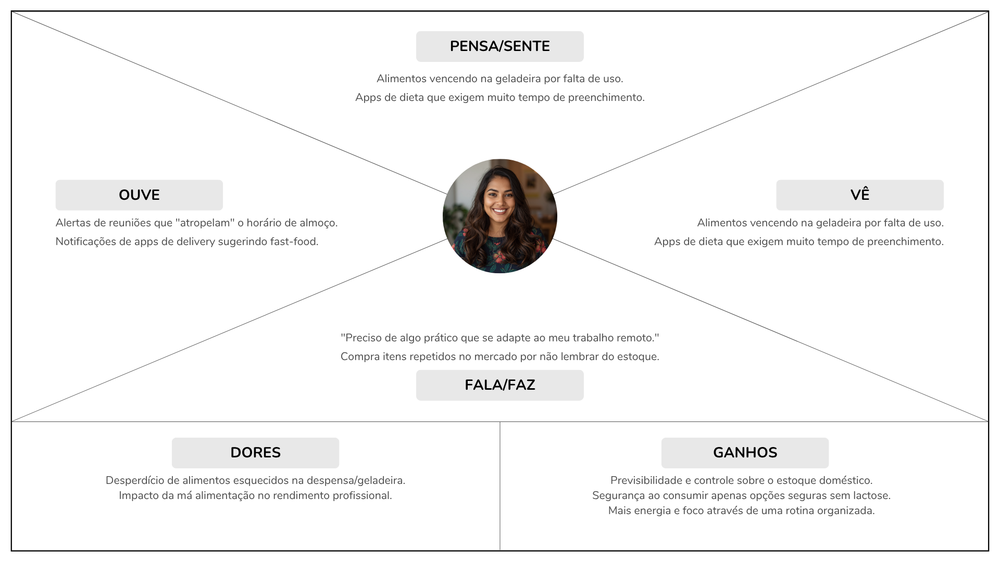 

### Persona 2: Lucas Andrade

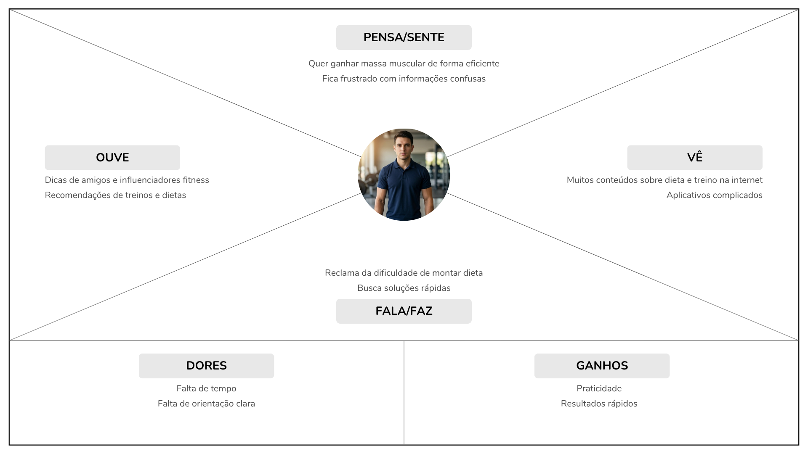 

### Persona 3: Mariana Souza

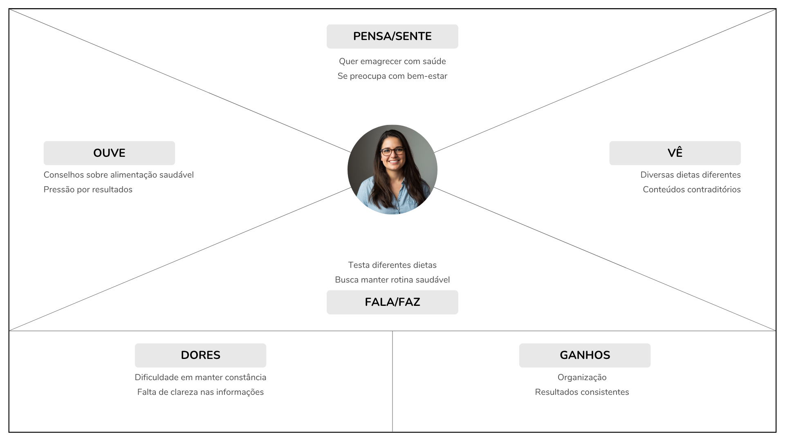 

### Persona 4: Amanda Santos

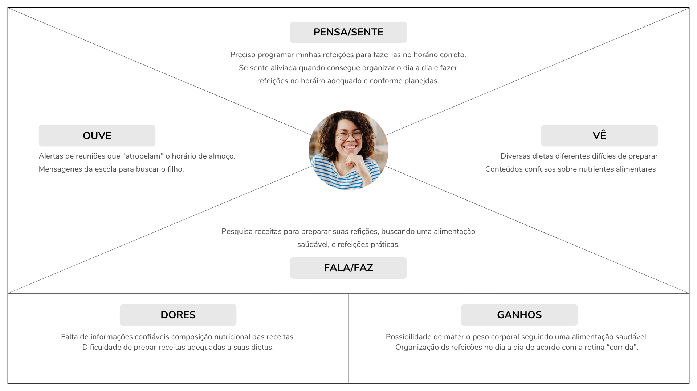

### Persona 5: Fernando Carvalho

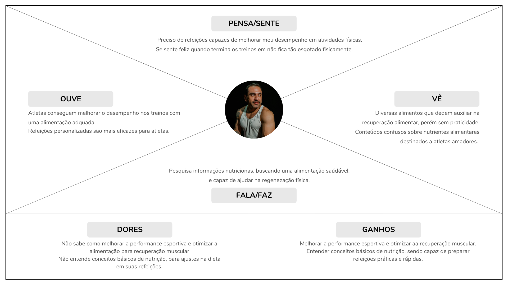

### Persona 6: Aurora Martins

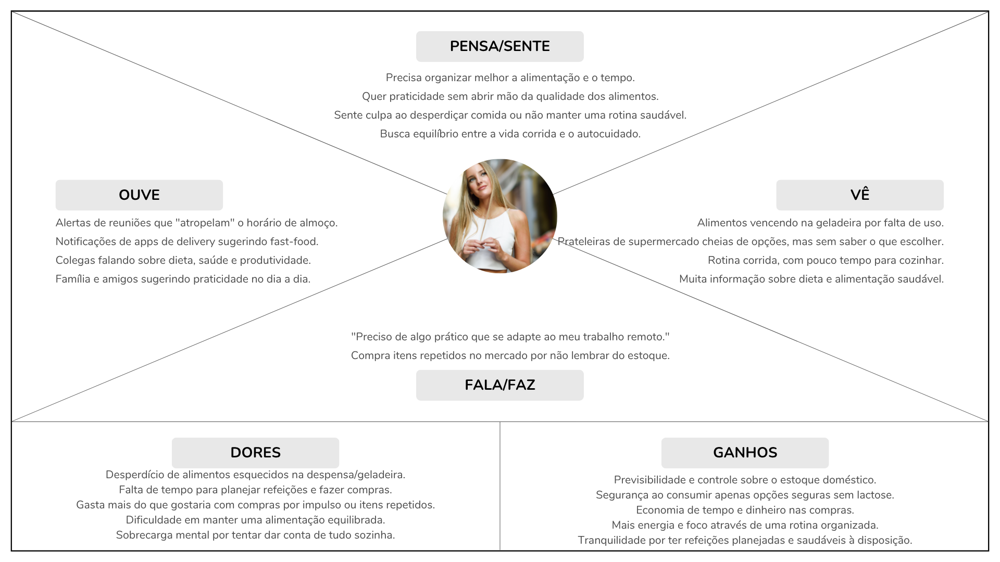

---

## 4.3 Protótipos das Interfaces

Nesta seção, são apresentados os protótipos das principais interfaces da aplicação BeFit, desenvolvidos com o objetivo de demonstrar a organização visual, funcional e interativa do sistema. As telas foram projetadas considerando critérios de usabilidade, clareza na navegação, consistência visual e facilidade de uso pelo usuário final.

Os protótipos contemplam as funcionalidades centrais da aplicação, como login, cadastro de usuário, criação de dietas, consulta de receitas, planejamento alimentar, lista de compras, cálculo de IMC e geração de relatórios. A análise de cada tela considera três dimensões principais: princípios gestálticos aplicados, recomendações ergonômicas e Regras de Ouro de Shneiderman.

De modo geral, a interface utiliza uma identidade visual padronizada, com predominância das cores laranja, verde e branco, associadas à temática de alimentação saudável, bem-estar e organização. Também se observa a repetição de elementos como menu superior, botões de ação, cards informativos, imagens temáticas e rodapé, garantindo maior familiaridade ao usuário durante a navegação.

### Tela Inicial

### Objetivo da Tela 

A Tela Inicial tem como objetivo apresentar a proposta da plataforma de forma clara e intuitiva logo no primeiro contato do usuário com o sistema. A interface busca incentivar o engajamento por meio da apresentação das principais funcionalidades da aplicação, oferecendo acesso rápido às ações de cadastro e login. O layout transmite organização, simplicidade e acolhimento visual, facilitando a navegação inicial e a compreensão da proposta do sistema.

### Princípios Gestálticos Aplicados

* **Proximidade:** Botões de acesso e informações principais estão agrupados de forma funcional.

* **Semelhança:** Botões, menus e elementos visuais seguem o mesmo padrão estético da aplicação.
  
* **Figura-Fundo:** O contraste entre os elementos principais e o fundo direciona a atenção para as ações centrais.

* **Continuidade:** A disposição horizontal do menu e o fluxo visual da página facilitam a navegação.

* **Simplicidade (Pregnância):** O layout organizado e com poucos elementos visuais reduz distrações e melhora a compreensão.

### Recomendações Ergonômicas

* Informações principais apresentadas logo na entrada facilitam o entendimento da plataforma.

* Botões de acesso rápido tornam a navegação mais intuitiva.

* Estrutura visual organizada reduz a carga cognitiva inicial.

* Menu superior facilita o acesso às funcionalidades do sistema.

### Regras de Ouro de Shneiderman

1. **Consistência:** Mesmo estilo visual da aplicação (cores, botões, tipografia).

2. **Atalhos:** Botões de acesso rápido para login e cadastro reduzem etapas.

3. **Feedback:** Destaque visual nos botões principais orienta a interação.

4. **Diálogo com fechamento:** Navegação simples facilita o entendimento do fluxo inicial.

5. **Prevenção de erros:** Estrutura clara reduz dúvidas durante a navegação.

6. **Reversão fácil:** Usuário pode navegar livremente entre as opções disponíveis.

7. **Controle do usuário:** Usuário pode decidir entre logar ou criar conta.

8. **Baixa carga cognitiva:** Interface limpa e objetiva facilita o primeiro contato com o sistema.

---

### Tela de Cadastro
   
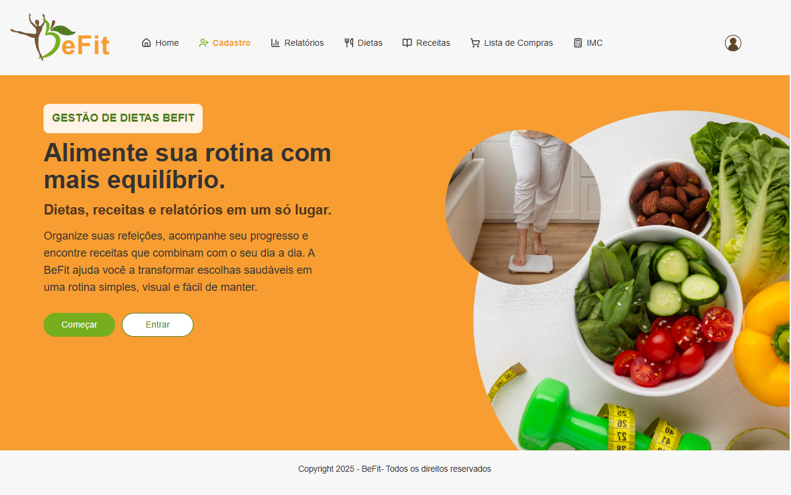

### Objetivo da Tela  

A Tela de Cadastro tem como objetivo permitir que novos usuários criem suas contas na plataforma de forma rápida, segura e intuitiva, sem sair da Tela Inicial. Por meio de um formulário simplificado e focado na conversão, a interface busca coletar as informações essenciais para a utilização do sistema, garantindo a integridade dos dados através da confirmação de senha. O layout em formato de pop-up prioriza a clareza visual e o foco na tarefa, minimizando distrações e facilitando a transição do visitante para usuário ativo da plataforma.

### Princípios Gestálticos Aplicados  

* **Proximidade:** Campos relacionados, como nome, e-mail e senha, estão agrupados no mesmo bloco visual.

* **Semelhança:** Todos os inputs seguem padrão visual uniforme, reforçando a consistência da interface.

* **Continuidade:** O fluxo vertical guia o preenchimento passo a passo.

* **Figura-Fundo:** O modal se destaca sobre a página inicial, concentrando a atenção do usuário no formulário de cadastro.

* **Pregnância:** Layout simples e organizado melhora a compreensão da tarefa.

### Recomendações Ergonômicas  

* Campos organizados em sequência lógica facilitam o preenchimento.

* Rótulos claros reduzem dúvidas durante o cadastro.

* Campo de confirmação de senha contribui para prevenção de erros.

* Link para login oferece alternativa rápida para usuários já cadastrados.

* O botão de fechar permite que o usuário retorne à Tela Inicial sem concluir o cadastro.

### Regras de Ouro de Shneiderman  

1. **Consistência:** O modal mantém a mesma identidade visual utilizada no restante da aplicação.

2. **Atalhos:** Link para login evita retrabalho para usuários já cadastrados.

3. **Feedback:** O botão "Cadastrar" indica claramente a ação principal do modal.

4. **Diálogo com fechamento:** O processo de cadastro possui fluxo simples e objetivo, com início, preenchimento e conclusão definidos.

5. **Prevenção de erros:** Campo de confirmação de senha evita inconsistências nos dados.

6. **Reversão fácil:** O usuário pode fechar o modal ou retornar ao login sem concluir o cadastro.

7. **Controle do usuário:** O usuário escolhe entre concluir o cadastro, voltar ao login ou retornar à Tela Inicial.

8. **Baixa carga cognitiva:** Campos organizados e objetivos evitam confusão durante o preenchimento.

---

### Tela de Login

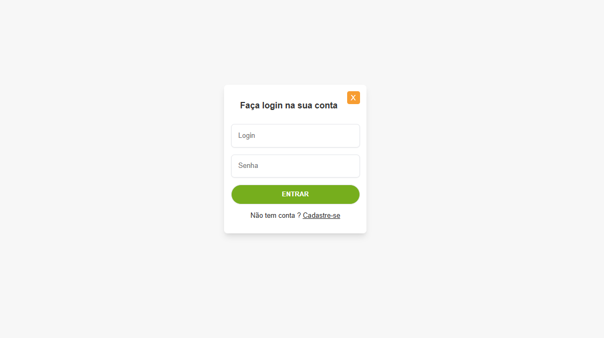

### Objetivo da Tela  

A Tela de Login tem como objetivo permitir que usuários já cadastrados acessem a plataforma de forma rápida, simples e segura, sem sair da Tela Inicial. A interface centraliza os campos essenciais de autenticação, reduzindo distrações e facilitando o retorno do usuário ao sistema. O layout em formato de pop-up direciona a atenção para a ação principal, mantendo a navegação inicial disponível ao fundo.

### Princípios Gestálticos Aplicados  

* **Proximidade:** Os campos de e-mail e senha estão agrupados no mesmo bloco visual, indicando que fazem parte do mesmo processo de autenticação.

* **Semelhança:** Os campos de entrada seguem o mesmo padrão visual, reforçando a consistência da interface.

* **Figura-Fundo:** O modal se destaca sobre a página inicial, criando foco na ação de login.

* **Fechamento:** O contorno do modal organiza os elementos como uma unidade completa de interação.

* **Simplicidade (Pregnância):** A interface apresenta apenas os elementos necessários para o acesso, tornando o processo objetivo e fácil de compreender.

### Recomendações Ergonômicas  

* Manter poucos campos no modal reduz a carga cognitiva e agiliza o processo de entrada.

* O destaque visual do pop-up direciona a atenção do usuário para a autenticação.

* O botão de login deve ter destaque para orientar o usuário sobre a próxima ação.

* O link para cadastro deve permanecer visível, oferecendo alternativa clara para novos usuários.

* O botão de fechar permite que o usuário retorne à Tela Inicial sem concluir o login.

### Regras de Ouro de Shneiderman  

1. **Consistência:** O modal mantém o mesmo padrão visual da aplicação, utilizando cores, botões, campos e tipografia semelhantes às demais interfaces.

2. **Atalhos:** O link para cadastro permite que novos usuários sigam rapidamente para a criação de conta.

3. **Feedback:** O botão "Entrar" indica claramente a ação principal, e mensagens de erro podem orientar o usuário em caso de dados inválidos.

4. **Diálogo com fechamento:** O processo de login possui início, ação e conclusão bem definidos: informar os dados, clicar em entrar e acessar o sistema.

5. **Prevenção de erros:** A interface simples, com campos bem identificados, reduz dúvidas no preenchimento das informações de acesso.

6. **Reversão fácil:** O usuário pode fechar o modal e retornar à Tela Inicial sem concluir a ação.

7. **Controle do usuário:** O usuário decide se deseja acessar sua conta, voltar à Tela Inicial ou seguir para o cadastro.

8. **Baixa carga cognitiva:** O modal apresenta poucos elementos e exige apenas as informações essenciais para autenticação.

---

### Tela Home / Tela Principal

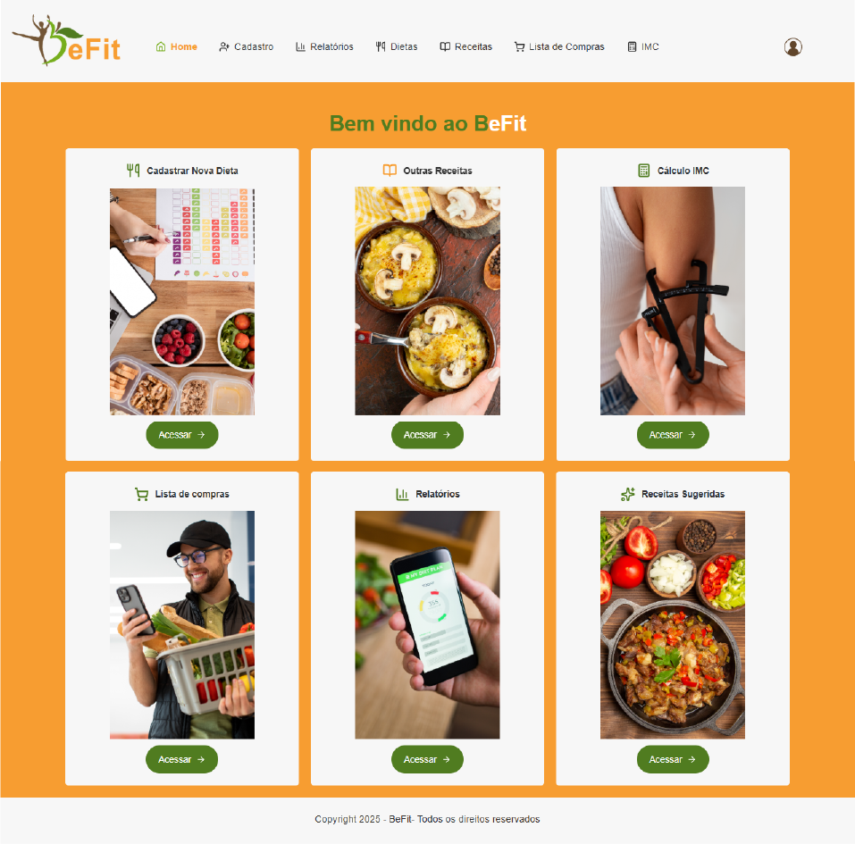

### Objetivo da Tela  

A Tela Home tem como objetivo apresentar, de forma clara e intuitiva, o ecossistema de funcionalidades do sistema, servindo como um painel de controle central para o usuário logado. Através de uma organização visual baseada em cards, a interface permite que o usuário identifique e acesse rapidamente recursos essenciais, como o cadastro de dietas, receitas, cálculo de IMC, lista de compras e relatórios. O foco central é facilitar a navegabilidade, reduzir o esforço de decisão e promover uma experiência de uso organizada, na qual o usuário encontra tudo o que precisa para sua rotina de saúde em um único lugar.

### Princípios Gestálticos Aplicados

* **Proximidade:** Elementos relacionados, como título, imagem e botão de acesso, estão agrupados visualmente dentro de cada card, facilitando a leitura e compreensão da funcionalidade apresentada.

* **Semelhança:** Os cards possuem estilos consistentes (cores, bordas, tipografia e botões semelhantes), indicando que pertencem à mesma categoria de ação.

* **Figura-Fundo:** O contraste entre o fundo laranja e os elementos em branco/verde destaca claramente o conteúdo principal, direcionando a atenção do usuário.

* **Continuidade:** O layout segue uma leitura natural em grade, guiando o usuário intuitivamente entre as funcionalidades disponíveis.

* **Pregnância (boa forma):** A interface é limpa, com cards padronizados e organização clara, reduzindo a carga cognitiva.

### Recomendações Ergonômicas

* Organização em cards facilita a identificação das funcionalidades principais.

* Botões destacados reduzem o esforço de decisão do usuário.

* Uso de imagens auxilia no reconhecimento visual das ações disponíveis.

* Navegação superior fixa melhora orientação e acesso às telas do sistema.

* Padronização dos cards contribui para uma experiência mais intuitiva e previsível.

### Regras de Ouro de Shneiderman

1. **Consistência:** Navegação superior padronizada em todas as telas e cards com estrutura visual semelhante.

2. **Atalhos:** Menu direto e botões “Acessar” permitem acesso rápido às funcionalidades principais.

3. **Feedback:** Botões com destaque visual indicam claramente ações disponíveis em cada card.

4. **Diálogo com fechamento:** A tela apresenta opções claras de acesso para cada funcionalidade do sistema.

5. **Prevenção de erros:** Interface simples e separada por cards evita cliques incorretos.

6. **Reversão fácil:** Usuário pode navegar livremente entre opções sem impacto.

7. **Controle do usuário:** O usuário decide qual funcionalidade deseja acessar de acordo com sua necessidade.

8. **Baixa carga cognitiva:** Informações visuais e bem organizadas evitam necessidade de memorização.

---

### Tela Cadastro de Dietas

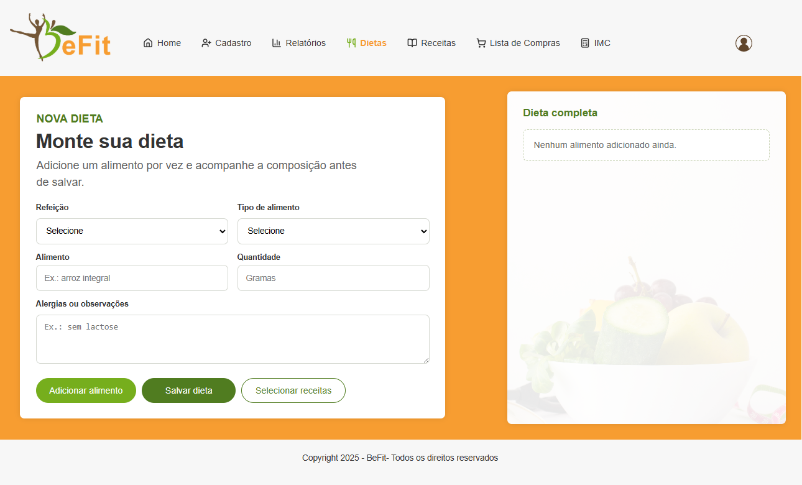

### Objetivo da Tela  

A Tela de Cadastro de Dietas tem como objetivo permitir que o usuário construa um plano alimentar personalizado de forma progressiva e estruturada. A interface foi desenhada para facilitar a inserção individual de alimentos, oferecendo uma visualização em tempo real da composição da dieta. Isso permite que ajustes sejam feitos de maneira dinâmica antes da finalização, garantindo que o plano final atenda com precisão às necessidades nutricionais e preferências do usuário.

### Princípios Gestálticos Aplicados 

* **Proximidade:** Campos agrupados indicam mesma tarefa.

* **Figura-Fundo:** Separação entre área de edição e visualização.

* **Semelhança:** Campos seguem padrão visual consistente.

* **Continuidade:** Fluxo vertical orienta preenchimento.

* **Hierarquia Visual:** Elementos guiam prioridade de uso.

### Recomendações Ergonômicas

* Uso de dropdowns reduz esforço cognitivo.

* Feedback imediato na visualização da dieta.

* Botões bem posicionados facilitam interação.

* Processo sequencial reduz erros.

### Regras de Ouro de Shneiderman

1. **Consistência:** Mantém padrão visual das demais telas.

2. **Atalhos:** Seleção de receitas acelera o processo.

3. **Feedback:** Área de visualização mostra estado atual.

4. **Diálogo com fechamento:** Botão “Salvar dieta” finaliza a tarefa.

5. **Prevenção de erros:** Campos guiados reduzem entradas inválidas.

6. **Reversão fácil:** Usuário pode revisar antes de salvar.

7. **Controle do usuário:** Total liberdade de personalização.

8. **Baixa carga cognitiva:** Informações visíveis reduzem memorização.

---

### Tela Receitas

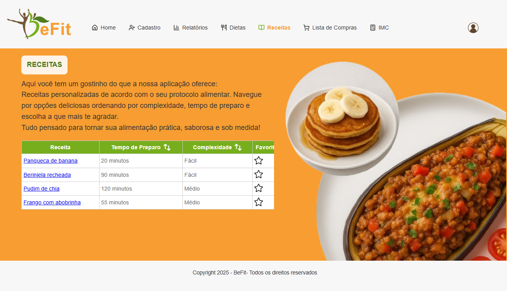

### Objetivo da Tela  

Apresentar receitas de forma organizada, permitindo que o usuário busque, compare e marque suas favoritas, facilitando a escolha de refeições com base no tempo de preparo e dificuldade.

### Princípios Gestálticos Aplicados

* **Proximidade:** Busca e resultados estão agrupados.

* **Semelhança:** Itens seguem padrão visual consistente.

* **Continuidade:** Linhas da tabela guiam leitura.

* **Figura-Fundo:** Tabela destacada do fundo.

* **Hierarquia Visual:** Título e busca recebem destaque.

### Recomendações Ergonômicas

* Estrutura facilita escaneabilidade.

* Informações visíveis reduzem esforço.

* Busca melhora eficiência.

* Uso de padrão de tabela facilita entendimento.

### Regras de Ouro de Shneiderman

1. **Consistência:** Layout segue padrão do sistema.

2. **Atalhos:** Ordenação permite acesso rápido à informação.

3. **Feedback:** Aba ativa indica localização.

4. **Diálogo com fechamento:** Busca gera resultado imediato.

5. **Prevenção de erros:** Categorias evitam ambiguidades.

6. **Reversão fácil:** Favoritar/desfavoritar é simples.

7. **Controle do usuário:** Usuário define forma de navegação.

8. **Baixa carga cognitiva:** Dados visíveis evitam navegação extra.

---

### Tela Agenda

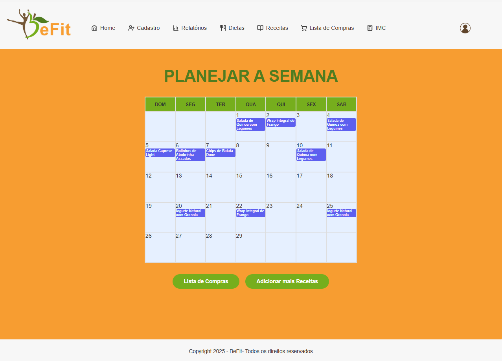

### Objetivo da Tela  

Permitir o planejamento alimentar semanal de forma visual e organizada, possibilitando que o usuário distribua suas refeições ao longo dos dias do mês para ter um controle claro de sua rotina nutricional e gerar sua lista de compras automaticamente.

### Princípios Gestálticos Aplicados 

* **Proximidade:** Dias e refeições organizados em grade.

* **Semelhança:** Células possuem padrão uniforme.

* **Continuidade:** Estrutura em linhas e colunas guia leitura.

* **Figura-Fundo:** Cabeçalho destacado da área de conteúdo.

* **Hierarquia Visual:** Elementos orientam fluxo de uso.

### Recomendações Ergonômicas

* Modelo de calendário facilita compreensão.

* Visualização completa reduz esforço cognitivo.

* Destaque do dia atual melhora orientação.

* Ações diretas com botões "+".

### Regras de Ouro de Shneiderman

1. **Consistência:** Mantém padrão visual do sistema.

2. **Atalhos:** Navegação por semanas é rápida.

3. **Feedback:** Destaque do dia atual orienta usuário.

4. **Diálogo com fechamento:** Adição de receitas constrói o planejamento.

5. **Prevenção de erros:** Estrutura fixa evita inconsistência.

6. **Reversão fácil:** Alternância de visualização é reversível.

7. **Controle do usuário:** Usuário define planejamento livremente.

8. **Baixa carga cognitiva:** Informações organizadas visualmente.

---

### Tela Lista de Compras

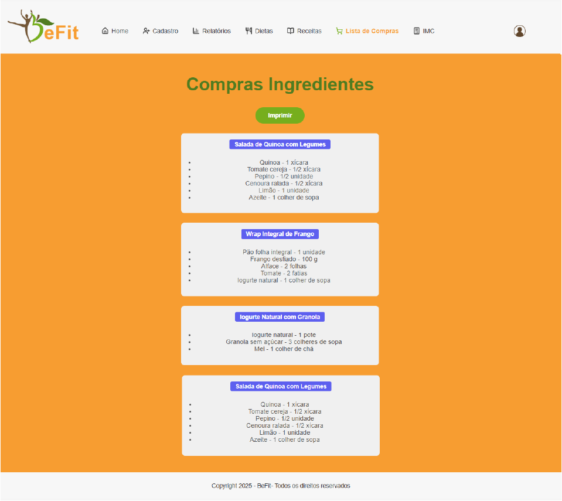

### Objetivo da Tela  

Permitir o gerenciamento dos itens necessários para a dieta, incluindo adição, controle e organização da lista.

### Princípios Gestálticos Aplicados 

* **Proximidade:** Campos e botão agrupados indicam ação única.

* **Semelhança:** Itens seguem padrão visual consistente.

* **Figura-Fundo:** Cards destacados do fundo.

* **Continuidade:** Lista organizada verticalmente.

* **Hierarquia Visual:** Título e ações possuem destaque.

### Recomendações Ergonômicas

* Checkboxes facilitam controle visual.

* Feedback com contadores de progresso.

* Inserção direta aumenta eficiência.

* Botões facilitam interação.

### Regras de Ouro de Shneiderman

1. **Consistência:** Interface mantém padrão do sistema.

2. **Atalhos:** Inserção direta agiliza uso.

3. **Feedback:** Contadores mostram progresso.

4. **Diálogo com fechamento:** Marcação de itens gera sensação de conclusão.

5. **Prevenção de erros:** Campos orientam preenchimento.

6. **Reversão fácil:** Itens podem ser removidos.

7. **Controle do usuário:** Usuário gerencia toda a lista.

8. **Baixa carga cognitiva:** Informações visíveis evitam memorização.

---
   
### Tela Cálculo de IMC

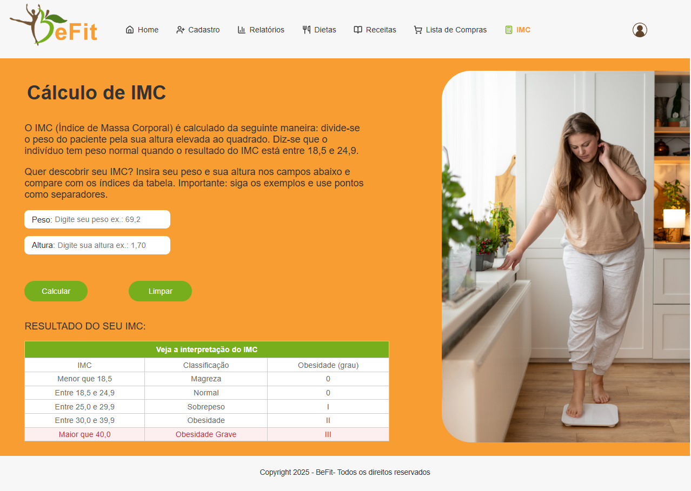

### Objetivo da Tela

A Tela de Cálculo de IMC tem como objetivo permitir que o usuário calcule seu Índice de Massa Corporal de forma rápida e intuitiva, inserindo peso e altura para comparação imediata com uma tabela de classificação, ao mesmo tempo em que educa o usuário sobre o significado do índice e fornece um feedback visual claro sobre sua faixa de saúde, seja ela magreza, normalidade ou sobrepeso.

### Princípios Gestálticos Aplicados
   
* **Proximidade:** Os campos de entrada (Peso e Altura) estão próximos entre si, sugerindo que pertencem à mesma etapa de interação. A tabela está separada, indicando ser uma referência.
  
* **Similaridade/Região comum:** Os campos de entrada usam o mesmo estilo visual (caixas de texto com exemplos), e a tabela usa formatação uniforme.
  
* **Simetria:** Os objetos são distribuídos de forma simétrica na tela, havendo um equilíbrio entre o bloco de texto à esquerda e a imagem à direita.
  
* **Fecho:** A tabela com bordas e linhas organiza as informações de modo que o cérebro completa a estrutura como um bloco único.
  
* **Figura-Fundo:** O título “RESULTADO DO SEU IMC” e a tabela se destacam do fundo, criando hierarquia visual.
  
* **Continuidade:** A leitura da tabela é fluida (linhas alinhadas, colunas claras). O fluxo de leitura é vertical.

### Recomendações Ergonômicas
 
* Apresenta baixa carga de trabalho, pois a tela possui poucos campos e instruções curtas.
  
* Percebe-se a consistência de informações, ao serem distribuídas na tabela, separada por três grupos complementares (IMC, Classificação e Grau), para interpretação dos resultados objetivos do cálculo do IMC.
  
* Fonte de tamanho adequado, contraste bom (fontes preto/cinza sobre branco/laranja).
  
* Estética e design minimalista: Layout limpo, sem poluição visual.
  
### Regras de Ouro de Shneiderman
 	
1. **Consistência:** Os ícones utilizados são simples e de fácil reconhecimento. Além disso, possui consistência pelo uso do mesmo estilo de ícones. O uso de texto acompanhado dos ícones reduz erros, ajuda usuários iniciantes e melhora acessibilidade. A tabela com as informações da classificação do IMC é bem distribuída e padronizada.

2. **Atalhos:** O botão "Calcular" permite acesso rápido à principal funcionalidade da tela.

3. **Feedback:** Embora não visível nesta imagem, o botão "Calcular" é um componente que fornece feedback ao ser clicado (resultado do IMC).

4. **Diálogo com fechamento:** O resultado apresentado sinaliza a conclusão do cálculo realizado.
   
5. **Prevenção de erros:** O projeto da interface evita erros ao não permitir entradas inválidas durante o preenchimento dos campos.
   
6. **Reversão fácil:** O usuário pode limpar os campos e inserir novos valores facilmente.

7. **Controle do usuário:** O usuário pode corrigir os campos, utilizando o botão “limpar”. Além disso, pode inserir valores livremente para realizar o cálculo do IMC, bastando simplesmente clicar no botão “Calcular”, após inserir os valores do peso e da altura.

8. **Baixa carga cognitiva:** Primando em reconhecer em vez de lembrar. As informações da tabela estão visíveis para consulta.

---

### Tela Relatórios

### Objetivo da Tela

Permitir ao usuário acessar e gerar relatórios de consumo alimentar e IMC de forma rápida, visual e organizada, com informações resumidas sobre seu histórico.

### Princípios Gestálticos Aplicados

* **Proximidade:** os blocos de Consumo e IMC estão agrupados individualmente com seus respectivos dados e ações.

* **Figura-Fundo:** os cards brancos se destacam sobre o fundo laranja, facilitando foco nas informações.

* **Semelhança:** ambos os relatórios utilizam o mesmo padrão visual (ícone, título, descrição e botão).

* **Continuidade:** a leitura segue fluxo vertical (título → descrição → dados → ação).

* **Hierarquia Visual:** títulos maiores, ícones e botões verdes guiam o usuário para ações principais.

### Recomendações Ergonômicas

* Informações resumidas reduzem carga cognitiva.
  
* Uso de ícones auxilia no reconhecimento rápido.
  
* Botões grandes facilitam interação (especialmente em telas touch).
  
* Feedback implícito (status, data, IMC) melhora entendimento imediato.

### Regras de Ouro de Shneiderman

1. **Consistência:** Layout segue padrão das demais telas (cores, botões, cards).

2. **Atalhos:** Botão “Gerar Relatório” permite acesso direto à funcionalidade.

3. **Feedback:** Exibição de data, status e IMC fornece retorno ao usuário.

4. **Diálogo com fechamento:** A ação de gerar relatório leva a uma nova tela com conclusão clara.

5. **Prevenção de erros:** Interface não exige entrada manual nesta etapa.

6. **Reversão fácil:** Usuário pode simplesmente não gerar ou voltar.

7. **Controle do usuário:** Usuário decide qual relatório acessar.

8. **Baixa carga cognitiva:** Informações visíveis eliminam necessidade de memorização.

---

### Tela Relatório Gerado

### Objetivo da Tela

Permitir ao usuário visualizar um relatório consolidado de IMC já gerado, oferecendo opções de ações adicionais como impressão, visualização do último cálculo e acesso a conteúdos relacionados.

### Princípios Gestálticos Aplicados 

* **Proximidade:** os botões de ação (Imprimir, Mostrar Último IMC e Mostrar Receitas) estão agrupados, indicando funcionalidades relacionadas.

* **Figura-Fundo:** o card do relatório se destaca do fundo laranja, facilitando o foco nas informações principais.

* **Semelhança:** os botões seguem o mesmo padrão visual, com cores e formatos consistentes.

* **Continuidade:** o fluxo de leitura ocorre de cima para baixo, iniciando no título, passando pelas ações e chegando aos dados do relatório.

* **Hierarquia Visual:** o título “Relatório Gerado” e os botões de ação possuem maior destaque, guiando o usuário.

### Recomendações Ergonômicas

* Botões com ícones facilitam reconhecimento e reduzem esforço cognitivo.
  
* Ações principais estão visíveis sem necessidade de navegação adicional.
  
* Informações organizadas em blocos melhoram a leitura e compreensão.
  
* Uso de contraste adequado melhora legibilidade.

### Regras de Ouro de Shneiderman

1. **Consistência:** Interface mantém o mesmo padrão visual das demais telas do sistema.

2. **Atalhos:** Botões de ação permitem acesso rápido a funcionalidades importantes.

3. **Feedback:** A exibição do relatório indica que a ação foi concluída com sucesso.

4. **Diálogo com fechamento:** A tela representa o encerramento do processo de geração do relatório.

5. **Prevenção de erros:** Não há necessidade de inserção de dados, reduzindo possibilidade de erro.

6. **Reversão fácil:** Usuário pode retornar para gerar novos relatórios ou acessar outras funcionalidades.

7. **Controle do usuário:** Usuário decide quais ações executar a partir do relatório exibido.

8. **Baixa carga cognitiva:** Informações estão organizadas e visíveis, evitando necessidade de memorização.

---

## 4.4 Testes com Protótipos

### Objetivo dos Testes

Os testes de usabilidade foram realizados com usuários alinhados ao perfil das personas definidas no projeto, com o objetivo de avaliar a usabilidade, a clareza das informações e a adequação do design das interfaces desenvolvidas.

### Aplicação dos Testes

Cada integrante do grupo conduziu um teste com um usuário distinto, aplicando tarefas específicas relacionadas à funcionalidade desenvolvida. Durante os testes, foram registradas observações sobre comportamento, dificuldades, erros e tempo de execução das tarefas. Ao final, foi aplicado o questionário SUS (System Usability Scale) para avaliação da percepção de usabilidade.

### Funcionalidades Avaliadas

Com o objetivo de analisar o sistema, aplicamos um teste com a metodologia System Usability Scale (SUS), dos seguintes requisitos: 

* Navegação pela tela inicial
* Cadastro e login
* Gerenciamento de dietas
* Agenda alimentar
* Receitas
* Cálculo de IMC
* Relatórios

### Questionário SUS

A seguir apresentamos o questionário com 10 perguntas baseado na ferramenta SUS, adaptado ao contexto da aplicação BeFit, que foi aplicado aos usuários:

### Questionário de Usabilidade – BeFit 
*(SUS - System Usability Scale)*

1. A interface do sistema é bem intuitiva e fácil de usar, pois é muito fácil acessar e imprimir a lista de compras.
2. Os ícones utilizados no sistema são pouco funcionais e intuitivos, prejudicando a linguagem visual, e consequentemente dificultando a navegação.
3. O sistema BeFit fácil de usar, principalmente o cálculo de IMC para o controle de peso.
4. O BeFit é desnecessariamente complexo para realizar tarefas como acessar receitas, relatórios ou a agenda alimentar.
5. Eu gostaria de usar o sistema com frequência, pois o controle das refeições com a agenda é fácil de usar.
6. Eu precisaria da ajuda de alguém com conhecimento técnico para utilizar o BeFit.
7. As funcionalidades do BeFit, como acessar a tela home (cadastro/login, relatórios, receitas, IMC e agenda alimentar) estão bem integradas entre si.
8. Eu percebi muita inconsistência no funcionamento ou na navegação entre as telas do BeFit.
9. As pessoas aprenderiam como usar esse sistema rapidamente, pois é muito fácil gerar e acompanhar relatórios.
10. Eu me senti confuso ao utilizar o BeFit para acompanhar minha alimentação e dados relacionados à dieta sugerida.

**Instrução ao respondente:**

Para cada afirmação, avalie seu nível de concordância em uma escala de 1 a 5, onde:

1 = Discordo totalmente | 2 = Discordo | 3 = Neutro | 4 = Concordo | 5 = Concordo totalmente.

**Pontuação coletada com os questionários por usuário:**

Usuário 01:

Questão 01 = 4 | Questão 02 = 2 | Questão 03 = 4 | Questão 04 = 1 | Questão 05 = 5 |  Questão 06 = 1  | Questão 07 = 4 | Questão 08 = 3 | Questão 09 = 5 | Questão 10 = 4 

Usuário 02:

Questão 01 = 5 | Questão 02 = 2 | Questão 03 = 5 | Questão 04 = 2 | Questão 05 = 4 | Questão 06 = 1 | Questão 07 = 5 | Questão 08 = 1 | Questão 09 = 4 | Questão 10 = 3  

Usuário 03:

Questão 01 =   | Questão 02 =  | Questão 03 =  | Questão 04 =  | Questão 05 =  |  Questão 06 =   | Questão 07 =  | Questão 08 =  | Questão 09 =  | Questão 10 =  

Usuário 04:

Questão 01 =   | Questão 02 =  | Questão 03 =  | Questão 04 =  | Questão 05 =  |  Questão 06 =   | Questão 07 =  | Questão 08 =  | Questão 09 =  | Questão 10 =  

Usuário 05:

Questão 01 =   | Questão 02 =  | Questão 03 =  | Questão 04 =  | Questão 05 =  |  Questão 06 =   | Questão 07 =  | Questão 08 =  | Questão 09 =  | Questão 10 =  

Usuário 06:

Questão 01 = 4  | Questão 02 = 2 | Questão 03 = 5 | Questão 04 = 3 | Questão 05 = 3 |  Questão 06 = 1  | Questão 07 = 5 | Questão 08 = 1 | Questão 09 = 3 | Questão 10 = 4 

**Pontuação média coletada com os questionários:**

Questão 01 = 4  | Questão 02 = 2 | Questão 03 = 5 | Questão 04 = 3 | Questão 05 = 3 | Questão 06 = 1  | Questão 07 = 5 | Questão 08 = 1 | Questão 09 = 3 | Questão 10 = 4 

### Análise dos resultados obtidos:

**1. Análise das respostas por questão:**

**Questões positivas (1, 3, 5, 7 e 9)**

Essas questões avaliam aspectos favoráveis da usabilidade, como facilidade de uso, integração das funcionalidades e aprendizado do sistema.

-	Q1 (média 4): Indica que a maioria dos usuários considera a interface intuitiva, destacando a facilidade em acessar funcionalidades como a lista de compras. Esse resultado evidencia um bom design de interação.
-	Q3 (média 5): Demonstra forte aceitação na facilidade de uso do sistema, principalmente no cálculo de IMC, uma funcionalidade essencial para o controle de peso.
-	Q5 (média 3): Sugere uma aceitação moderada quanto ao uso frequente do sistema. Embora seja positivo, indica espaço para melhorias que tornem o BeFit mais atrativo no uso contínuo.
-	Q7 (média 5): Mostra excelente percepção de integração entre as funcionalidades acessadas pela tela home, o que reforça a coerência da arquitetura da informação.
-	Q9 (média 3): Revela que os usuários veem o sistema como relativamente fácil de aprender, especialmente para geração e acompanhamento de relatórios, embora não de forma unanimemente positiva.

**Questões negativas (2, 4, 6, 8 e 10)**

Essas questões investigam possíveis problemas de complexidade, inconsistência e dificuldade de uso. Pontuações baixas são desejáveis.

-	Q2 (média 2): Indica que, em geral, os usuários não consideram os ícones pouco funcionais, sugerindo que a linguagem visual é adequada.
-	Q4 (média 3): Resultado neutro, apontando que parte dos usuários percebe certa complexidade em tarefas como acessar receitas ou relatórios. Essa questão merece atenção, pois pode impactar usuários menos experientes.
-	Q6 (média 1): Excelente resultado, demonstrando que os usuários não sentem necessidade de ajuda técnica para utilizar o sistema, reforçando sua autonomia.
-	Q8 (média 1): Indica baixa percepção de inconsistência na navegação entre telas, o que reforça a boa usabilidade e padronização do sistema.
-	Q10 (média 4): Aponta que alguns usuários se sentiram confusos ao acompanhar informações relacionadas à dieta, sugerindo a necessidade de melhorias na clareza das informações apresentadas.

**Resultado obtido com a análise a partir da metodologia da ferramenta SUS: 72,5.**

**Gráfico dos resultados do questionário a partir da análise SUS:**

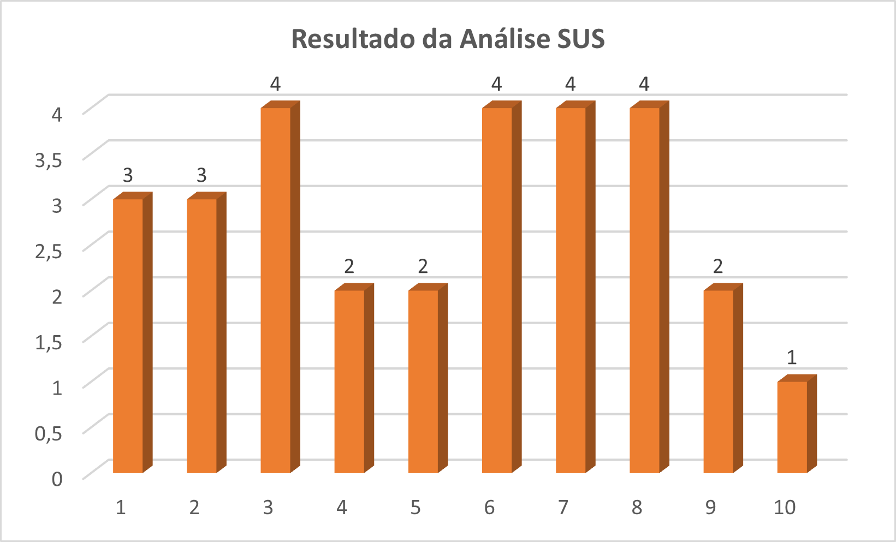 

**Gráfico dos resultados das respostas do questionário:**

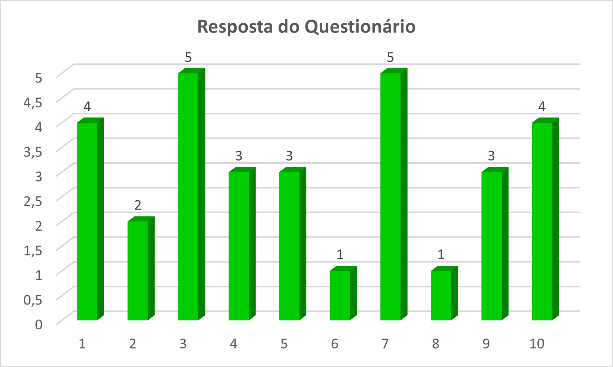

**Gráfico dos resultados do questionário a partir da análise SUS x Respostas do Questionário:**

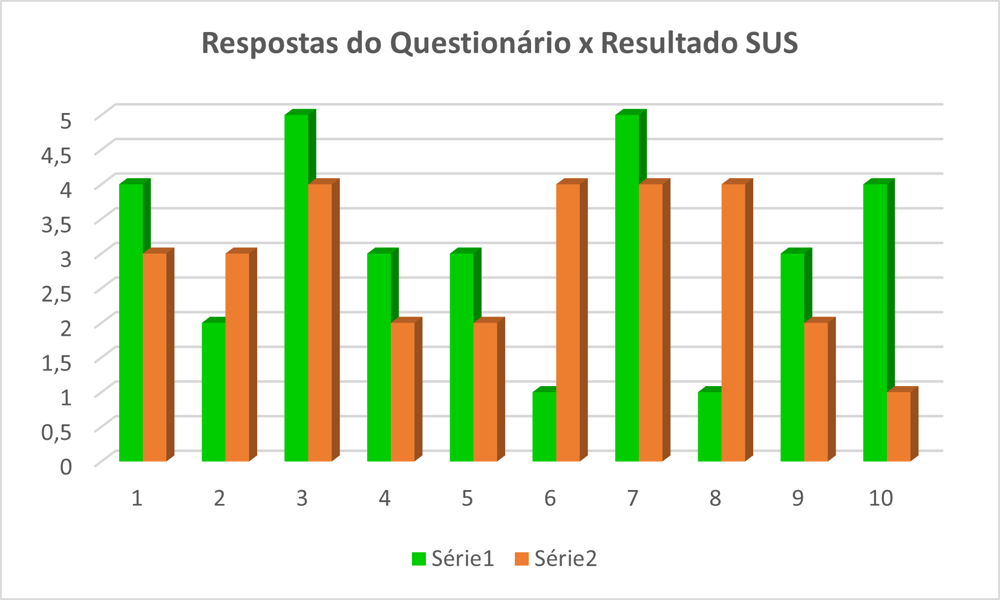 

**2. Análise do resultado SUS global:**

O score SUS obtido foi de 72,5. De acordo com a literatura da System Usability Scale:
-	Pontuações acima de 68 são consideradas acima da média;
-	Resultados entre 70 e 80 indicam boa usabilidade;
-	Sistemas com pontuação superior a 80 são considerados excelentes.

Dessa forma, o BeFit pode ser classificado como uma aplicação com boa usabilidade, sendo bem aceita pelos usuários e adequada para o público alvo proposto.

**3. Conclusão geral**

A análise dos resultados mostra que o BeFit atende de forma satisfatória aos critérios de usabilidade, especialmente no que se refere à facilidade de uso, integração das funcionalidades e autonomia do usuário. Pontos fortes incluem:
-	Facilidade no cálculo de IMC;
-	Boa integração entre telas;
-	Navegação consistente;
-	Baixa necessidade de suporte técnico.

Por outro lado, alguns aspectos podem ser aprimorados, como:
-	Reduzir percepções pontuais de complexidade;
-	Melhorar a clareza de informações relacionadas ao acompanhamento da dieta.

Em síntese, com pequenos ajustes de usabilidade e refinamento da interface, o BeFit tem potencial para alcançar níveis ainda mais altos de satisfação e eficiência no apoio à gestão alimentar.

---

Respostas do questionário atualizado:

Usuário  01:

Usuário  02:

Usuário  03:

Usuário  04:

Usuário  05:

Usuário  06:
