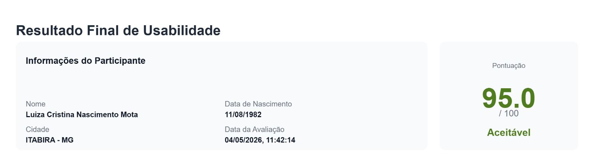

# 4. PROJETO DO DESIGN DE INTERAÇÃO

## 4.1 Personas

### Persona 1: Juliana Lopes

### Persona 2: Lucas Andrade

 

### Persona 3: Mariana Souza

 

### Persona 4: Amanda Santos

 

### Persona 5: Fernando Carvalho 

 

### Persona 6: Aurora Martins
 

---

## 4.2 Mapa de Empatia

### Persona 1: Juliana Lopes

 

### Persona 2: Lucas Andrade

 

### Persona 3: Mariana Souza

 

### Persona 4: Amanda Santos

### Persona 5: Fernando Carvalho

### Persona 6: Aurora Martins

---

## 4.3 Protótipos das Interfaces

Nesta seção, são apresentados os protótipos das principais interfaces da aplicação BeFit, desenvolvidos com o objetivo de demonstrar a organização visual, funcional e interativa do sistema. As telas foram projetadas considerando critérios de usabilidade, clareza na navegação, consistência visual e facilidade de uso pelo usuário final.

Os protótipos contemplam as funcionalidades centrais da aplicação, como cadastro de usuário, criação de dietas, consulta de receitas, planejamento alimentar, lista de compras, cálculo de IMC e geração de relatórios. A análise de cada tela considera três dimensões principais: princípios gestálticos aplicados, recomendações ergonômicas e Regras de Ouro de Shneiderman.

De modo geral, a interface utiliza uma identidade visual padronizada, com predominância das cores laranja, verde e branco, associadas à temática de alimentação saudável, bem-estar e organização. Também se observa a repetição de elementos como menu superior, botões de ação, cards informativos, imagens temáticas e rodapé, garantindo maior familiaridade ao usuário durante a navegação.

### Tela Home - Dashboard

### Princípios Gestálticos Aplicados

* **Proximidade:** Elementos relacionados, como título, descrição e botões ("Começar" e "Entrar"), estão agrupados visualmente, facilitando a leitura e compreensão da ação principal.

* **Semelhança:** Os botões possuem estilos consistentes (cores, bordas e tipografia), indicando que pertencem à mesma categoria de ação.

* **Figura-Fundo:** O contraste entre o fundo laranja e os elementos em branco/verde destaca claramente o conteúdo principal, direcionando a atenção do usuário.

* **Continuidade:** O layout segue uma leitura natural da esquerda para a direita (texto → imagem), guiando o usuário intuitivamente.

* **Pregnância (boa forma):** A interface é limpa, com poucos elementos e organização clara, reduzindo a carga cognitiva.

### Recomendações Ergonômicas

* Organização em cards facilita a identificação das funcionalidades principais.

* Botões destacados reduzem o esforço de decisão do usuário.

* Uso de imagens auxilia no reconhecimento visual das ações disponíveis.

* Navegação superior fixa melhora orientação e acesso às telas do sistema.

### Regras de Ouro de Shneiderman

1. **Consistência**  
   Navegação superior padronizada em todas as telas (Home, Cadastro, Relatórios etc.).

2. **Atalhos para usuários experientes**  
   Menu direto permite acesso rápido às funcionalidades principais.

3. **Feedback informativo**  
   Botões com destaque visual indicam claramente ações disponíveis.

4. **Diálogo com fechamento**  
   A tela apresenta início claro do fluxo (entrada no sistema).

5. **Prevenção de erros**  
   Interface simples evita cliques incorretos.

6. **Reversibilidade de ações**  
   Usuário pode navegar livremente entre opções sem impacto.

7. **Controle do usuário**  
   O usuário decide entre login ou cadastro.

8. **Redução da carga de memória**  
   Informações visuais e bem organizadas evitam necessidade de memorização.

---

### Tela Cadastro e Login na aplicação

  
### Princípios Gestálticos Aplicados - Login

* **Proximidade:** Campos de login e senha estão agrupados dentro de um card central, indicando relação funcional.

* **Semelhança:** Inputs seguem o mesmo padrão visual, reforçando consistência.

* **Figura-Fundo:** O formulário centralizado em fundo neutro cria foco total na tarefa de login.

* **Fechamento:** O card delimitado sugere um bloco completo de interação.

* **Simplicidade (Pregnância):** A tela contém apenas os elementos essenciais para autenticação.

### Recomendações Ergonômicas

* Formulário centralizado direciona a atenção para a tarefa principal.

* Poucos campos reduzem a carga cognitiva durante o login.

* Botões e links bem posicionados facilitam a escolha entre entrar ou cadastrar-se.

* Estrutura simples melhora a compreensão e reduz chances de erro.

### Regras de Ouro de Shneiderman

1. **Consistência**  
   Mesmo estilo visual da aplicação (cores, botões, tipografia).

2. **Atalhos**  
   Link direto para cadastro reduz etapas.

3. **Feedback**  
   Botão "Entrar" destaca a ação principal.

4. **Diálogo com fechamento**  
   Processo de login é claro e direto.

5. **Prevenção de erros**  
   Estrutura simples reduz chances de erro.

6. **Reversão fácil**  
   Botão de fechar (X) permite sair do modal.

7. **Controle do usuário**  
   Usuário pode decidir entre logar ou criar conta.

8. **Baixa carga cognitiva**  
   Apenas dois campos obrigatórios.

---
   
### Tela Cadastro
   

### Princípios Gestálticos Aplicados 

* **Proximidade**: Campos relacionados (nome, email, senha) estão agrupados.

* **Semelhança**: Todos os inputs seguem padrão uniforme.

* **Continuidade**: Fluxo vertical guia o preenchimento passo a passo.

* **Figura-Fundo**: Destaque no formulário central facilita foco.

* **Pregnância**: Layout simples e organizado melhora compreensão.

### Recomendações Ergonômicas

* Campos organizados em sequência lógica facilitam o preenchimento.

* Rótulos claros reduzem dúvidas durante o cadastro.

* Campo de confirmação de senha contribui para prevenção de erros.

* Link para login oferece alternativa rápida para usuários já cadastrados.

### Regras de Ouro de Shneiderman

**Consistência**
Mesma identidade visual do login.

**Atalhos**
Link para login evita retrabalho.

**Feedback**
Botão "Cadastrar" indica ação final.

**Diálogo com fechamento** 
Processo termina com criação de conta.

**Prevenção de erros** 
Campo de confirmação de senha evita inconsistências.

**Reversibilidade**: 
Usuário pode voltar ao login.

**Controle do usuário**: 
Fluxo claro e opcional.

**Redução da carga de memória**: 
Campos claros e rotulados evitam confusão.

---

### Tela Cadastro de Dietas

### Objetivo da Tela  

Permitir a construção de um plano alimentar personalizado de forma progressiva, com visualização em tempo real e possibilidade de ajustes antes da finalização.

### Princípios Gestálticos Aplicados - Monte sua dieta

* **Proximidade:** Campos agrupados indicam mesma tarefa.

* **Figura-Fundo:** Separação entre área de edição e visualização.

* **Semelhança:** Campos seguem padrão visual consistente.

* **Continuidade:** Fluxo vertical orienta preenchimento.

* **Hierarquia Visual:** Elementos guiam prioridade de uso.

### Recomendações Ergonômicas

* Uso de dropdowns reduz esforço cognitivo.

* Feedback imediato na visualização da dieta.

* Botões bem posicionados facilitam interação.

* Processo sequencial reduz erros.

### Regras de Ouro de Shneiderman

1. **Consistência**  
   Mantém padrão visual das demais telas.

2. **Atalhos**  
   Seleção de receitas acelera o processo.

3. **Feedback**  
   Área de visualização mostra estado atual.

4. **Diálogo com fechamento**  
   Botão “Salvar dieta” finaliza a tarefa.

5. **Prevenção de erros**  
   Campos guiados reduzem entradas inválidas.

6. **Reversão fácil**  
   Usuário pode revisar antes de salvar.

7. **Controle do usuário**  
   Total liberdade de personalização.

8. **Baixa carga cognitiva**  
   Informações visíveis reduzem memorização.

   ---

### Tela de Receitas

### Objetivo da Tela  

Apresentar receitas de forma organizada, permitindo busca, comparação e seleção com base em tempo e complexidade.

### Princípios Gestálticos Aplicados - Receitas

* **Proximidade:** Busca e resultados estão agrupados.

* **Semelhança:** Itens seguem padrão visual consistente.

* **Continuidade:** Linhas da tabela guiam leitura.

* **Figura-Fundo:** Tabela destacada do fundo.

* **Hierarquia Visual:** Título e busca recebem destaque.

### Recomendações Ergonômicas

* Estrutura facilita escaneabilidade.

* Informações visíveis reduzem esforço.

* Busca melhora eficiência.

* Uso de padrão de tabela facilita entendimento.

### Regras de Ouro de Shneiderman

1. **Consistência**  
   Layout segue padrão do sistema.

2. **Atalhos**  
   Ordenação permite acesso rápido à informação.

3. **Feedback**  
   Aba ativa indica localização.

4. **Diálogo com fechamento**  
   Busca gera resultado imediato.

5. **Prevenção de erros**  
   Categorias evitam ambiguidades.

6. **Reversão fácil**  
   Favoritar/desfavoritar é simples.

7. **Controle do usuário**  
   Usuário define forma de navegação.

8. **Baixa carga cognitiva**  
   Dados visíveis evitam navegação extra.

   ---
   

### Tela Agenda

### Objetivo da Tela  

Permitir o planejamento alimentar semanal, organizando refeições por dia e horário de forma visual.

### Princípios Gestálticos Aplicados - Agenda

* **Proximidade:** Dias e refeições organizados em grade.

* **Semelhança:** Células possuem padrão uniforme.

* **Continuidade:** Estrutura em linhas e colunas guia leitura.

* **Figura-Fundo:** Cabeçalho destacado da área de conteúdo.

* **Hierarquia Visual:** Elementos orientam fluxo de uso.

### Recomendações Ergonômicas

* Modelo de calendário facilita compreensão.

* Visualização completa reduz esforço cognitivo.

* Destaque do dia atual melhora orientação.

* Ações diretas com botões "+".

### Regras de Ouro de Shneiderman

1. **Consistência**  
   Mantém padrão visual do sistema.

2. **Atalhos**  
   Navegação por semanas é rápida.

3. **Feedback**  
   Destaque do dia atual orienta usuário.

4. **Diálogo com fechamento**  
   Adição de receitas constrói o planejamento.

5. **Prevenção de erros**  
   Estrutura fixa evita inconsistência.

6. **Reversão fácil**  
   Alternância de visualização é reversível.

7. **Controle do usuário**  
   Usuário define planejamento livremente.

8. **Baixa carga cognitiva**  
   Informações organizadas visualmente.

---

### Tela de Lista de Compras

### Objetivo da Tela  

Permitir o gerenciamento dos itens necessários para a dieta, incluindo adição, controle e organização da lista.

### Princípios Gestálticos Aplicados - Lista de Compras

* **Proximidade:** Campos e botão agrupados indicam ação única.

* **Semelhança:** Itens seguem padrão visual consistente.

* **Figura-Fundo:** Cards destacados do fundo.

* **Continuidade:** Lista organizada verticalmente.

* **Hierarquia Visual:** Título e ações possuem destaque.

### Recomendações Ergonômicas

* Checkboxes facilitam controle visual.

* Feedback com contadores de progresso.

* Inserção direta aumenta eficiência.

* Botões facilitam interação.

### Regras de Ouro de Shneiderman

1. **Consistência**  
   Interface mantém padrão do sistema.

2. **Atalhos**  
   Inserção direta agiliza uso.

3. **Feedback**  
   Contadores mostram progresso.

4. **Diálogo com fechamento**  
   Marcação de itens gera sensação de conclusão.

5. **Prevenção de erros**  
   Campos orientam preenchimento.

6. **Reversão fácil**  
   Itens podem ser removidos.

7. **Controle do usuário**  
   Usuário gerencia toda a lista.

8. **Baixa carga cognitiva**  
   Informações visíveis evitam memorização.

   ---
   
### Tela Cálculo de IMC

### Objetivo da Tela:

-	Permitir que o usuário calcule seu Índice de Massa Corporal (IMC) de forma rápida e intuitiva, inserindo peso e altura, e comparando o resultado com uma tabela de classificação.
-	Educar o usuário sobre o significado do IMC.
-	Fornecer feedback visual claro sobre a faixa de classificação (magreza, normal, sobrepeso, etc.).

### Princípios Gestálticos aplicados
   
-	**Proximidade:** Os campos de entrada (Peso e Altura) estão próximos entre si, sugerindo que pertencem à mesma etapa de interação. A tabela está separada, indicando ser uma referência.
  
-	**Similaridade/Região comum:** Os campos de entrada usam o mesmo estilo visual (caixas de texto com exemplos), e a tabela usa formatação uniforme.
  
-	**Simetria:** Os objetos são distribuídos de forma simétrica na tela, havendo um equilíbrio entre o bloco de texto à esquerda e a imagem à direita.
  
-	**Fecho:** A tabela com bordas e linhas organiza as informações de modo que o cérebro completa a estrutura como um bloco único.
  
-	**Figura-Fundo:** O título “RESULTADO DO SEU IMC” e a tabela se destacam do fundo, criando hierarquia visual.
  
-	**Continuidade:** A leitura da tabela é fluida (linhas alinhadas, colunas claras). O fluxo de leitura é vertical.

### Recomendações Ergonômicas
 
-	Carga de trabalho: Apresenta baixa carga de trabalho, a tela possui poucos campos e instruções curtas.
  
-	Consistência: Percebe-se a consistência de informações, ao serem distribuídas na tabela, separada por três grupos complementares (IMC, Classificação e Grau), para interpretação dos resultados objetivos do cálculo do IMC.
  
-	Legibilidade: Fonte de tamanho adequado, contraste bom (fontes preto/cinza sobre branco/laranja).
  
-	Estética e design minimalista: Layout limpo, sem poluição visual.
  
### Regras de Ouro da Interface de Shneiderman
 	
1. **Consistência e padronização:** Os ícones utilizados são simples é de fácil reconhecimento e baixo esforço cognitivo. Além disso, possui consistência pelo uso do mesmo estilo de ícones. O uso de texto acompanhado dos ícones reduz erros, ajuda usuários iniciantes e melhora acessibilidade. A tabela com as informações da classificação do IMC e bem distribuída e padronizada.

2. **Fornecer Prevenção de Erros e Forma Simples de Corrigi-los:** Projeto da interface evita erros, caso o usuário tente inserir dados inválidos, para o cálculo do IMC, não é permitido.

3. **Feedbacks Informativos:** Embora não visível nesta imagem, o botão "Calcular" é um componente que fornece feedback ao ser clicado (resultado do IMC).

4. **Fornece Controle de Iniciativa do Usuário:** O usuário pode corrigir os campos, utilizando o botão “limpar”. Além disso, pode inserir valores livremente para realizar o cálculo do IMC, bastando simplesmente clicar no botão “Calcular”, após inserir os valores do peso e da altura.

5. **Reduz a Carga de Memória de Trabalho:** Primando em reconhecer em vez de lembrar. As informações da tabela estão visíveis para consulta.

---

### Tela de Relatórios

**Objetivo da Tela**

Permitir ao usuário acessar e gerar relatórios de consumo alimentar e IMC de forma rápida, visual e organizada, com informações resumidas sobre seu histórico.

**Princípios Gestálticos Aplicados**
Proximidade: os blocos de Consumo e IMC estão agrupados individualmente com seus respectivos dados e ações.
Figura-Fundo: os cards brancos se destacam sobre o fundo laranja, facilitando foco nas informações.
Semelhança: ambos os relatórios utilizam o mesmo padrão visual (ícone, título, descrição e botão).
Continuidade: a leitura segue fluxo vertical (título → descrição → dados → ação).
Hierarquia Visual: títulos maiores, ícones e botões verdes guiam o usuário para ações principais.

**Recomendações Ergonômicas**
Informações resumidas reduzem carga cognitiva.
Uso de ícones auxilia no reconhecimento rápido.
Botões grandes facilitam interação (especialmente em telas touch).
Feedback implícito (status, data, IMC) melhora entendimento imediato.

Regras de Ouro de Shneiderman

**1. Consistência**
Layout segue padrão das demais telas (cores, botões, cards).
**2. Atalhos**
Botão “Gerar Relatório” permite acesso direto à funcionalidade.
**3. Feedback**
Exibição de data, status e IMC fornece retorno ao usuário.
**4. Diálogo com fechamento**
A ação de gerar relatório leva a uma nova tela com conclusão clara.
**5.Prevenção de erros**
Interface não exige entrada manual nesta etapa.
**6. Reversão fácil**
Usuário pode simplesmente não gerar ou voltar.
**7. Controle do usuário**
Usuário decide qual relatório acessar.
**9. Baixa carga cognitiva**
Informações visíveis eliminam necessidade de memorização.

### Tela: Relatório Gerado

**Objetivo da Tela**

Permitir ao usuário visualizar um relatório consolidado de IMC já gerado, oferecendo opções de ações adicionais como impressão, visualização do último cálculo e acesso a conteúdos relacionados.

**Princípios Gestálticos Aplicados**

**Proximidade:** os botões de ação (Imprimir, Mostrar Último IMC e Mostrar Receitas) estão agrupados, indicando funcionalidades relacionadas.
**Figura-Fundo:** o card do relatório se destaca do fundo laranja, facilitando o foco nas informações principais.
**Semelhança:** os botões seguem o mesmo padrão visual, com cores e formatos consistentes.
**Continuidade:** o fluxo de leitura ocorre de cima para baixo, iniciando no título, passando pelas ações e chegando aos dados do relatório.
**Hierarquia Visual:** o título “Relatório Gerado” e os botões de ação possuem maior destaque, guiando o usuário.

**Recomendações Ergonômicas**

Botões com ícones facilitam reconhecimento e reduzem esforço cognitivo.
Ações principais estão visíveis sem necessidade de navegação adicional.
Informações organizadas em blocos melhoram a leitura e compreensão.
Uso de contraste adequado melhora legibilidade.

**Regras de Ouro de Shneiderman**

**1. Consistência**
Interface mantém o mesmo padrão visual das demais telas do sistema.
**2. Atalhos**
Botões de ação permitem acesso rápido a funcionalidades importantes.
**3. Feedback**
A exibição do relatório indica que a ação foi concluída com sucesso.
**4. Diálogo com fechamento**
A tela representa o encerramento do processo de geração do relatório.
**5. Prevenção de erros**
Não há necessidade de inserção de dados, reduzindo possibilidade de erro.
**6. Reversão fácil**
Usuário pode retornar para gerar novos relatórios ou acessar outras funcionalidades.
**7. Controle do usuário**
Usuário decide quais ações executar a partir do relatório exibido.
**8. Baixa carga cognitiva**
Informações estão organizadas e visíveis, evitando necessidade de memorização.

---

## 4.4 Testes com Protótipos

Os testes de usabilidade foram realizados com usuários alinhados ao perfil das personas definidas no projeto, com o objetivo de avaliar a usabilidade, a clareza das informações e a adequação do design das interfaces desenvolvidas.

Cada integrante do grupo conduziu um teste com um usuário distinto, aplicando tarefas específicas relacionadas à funcionalidade desenvolvida. Durante os testes, foram registradas observações sobre comportamento, dificuldades, erros e tempo de execução das tarefas. Ao final, foi aplicado o questionário SUS (System Usability Scale) para avaliação da percepção de usabilidade.

> template(1 por integrante/tarefa/tela) --->

# Teste de Usabilidade 

### 🔹 Integrante: [NOME DO ALUNO]

**Funcionalidade Avaliada:** [Ex: Tela de Inventário / Cadastro]

## 👤 Perfil do Usuário

| Critério | Dados |
|:---|:---|
| Idade | [X] anos |
| Ocupação | [Profissão] |
| Familiaridade com tecnologia | [Baixa / Média / Alta] |

## 🎯 Tarefa Avaliada

**Descrição da tarefa:**  
[Descrever a tarefa realizada]

**Tempo de execução:**  
[X] minutos

**Resultado:**  
( ) Sucesso  
( ) Sucesso com dificuldade  
( ) Falha  

## 👀 Observações do Avaliador

-  ex.: O usuário leu a tela antes de iniciar a interação
-  
-  

## ⚠️ Dificuldades Identificadas

-  
-  
-  

## ❌ Erros Observados

-  
-  
-  

## 👍 Pontos Positivos

-  
-  
-  

## 💬 Comentários do Usuário

"Lorem ipsum dolor sit amet, consectetur adipiscing elit, sed do eiusmod tempor incididunt ut labore et dolore magna aliqua. Ut enim ad minim veniam, quis nostrud exercitation ullamco laboris nisi ut aliquip ex ea commodo consequat. Duis aute irure dolor in reprehenderit in voluptate velit esse cillum dolore eu fugiat nulla pariatur."

## 🔧 Sugestões de Melhoria

-  
-  
-  

## 📊 Questionário SUS (System Usability Scale)

- Pontuação obtida:  
- Classificação:  

> <--- fim do template 
---
>Cada integrante do grupo deverá aplicar o teste com um usuário distinto, preferencialmente alinhado ao perfil das personas criadas. Devem ser definidas previamente as tarefas que o usuário deverá executar no protótipo (por exemplo: realizar um cadastro, buscar um produto, concluir uma compra).

>Durante a aplicação do teste, registre observações sobre comportamentos, dúvidas, erros e comentários feitos pelo usuário, bem como o tempo necessário para a execução de cada tarefa. Ao final, colete o feedback do participante, destacando pontos positivos e aspectos a serem melhorados.

>Os resultados obtidos por todos os integrantes devem ser consolidados, apresentando uma análise geral com os principais problemas encontrados, oportunidades de melhoria e as ações previstas para o projeto final. 

>Sobre os testes de protótipos:

>Uma prática recomendada é definir um conjunto padrão de perguntas para os usuários. Assim, cada integrante do grupo aplica as mesmas questões a um usuário diferente (um usuário por integrante), permitindo posteriormente a síntese dos resultados, conforme solicitado na seção 4.4 do relatório.

>Segue um conjunto de perguntas sugeridas:

>1 - Ao acessar a página inicial, você compreendeu rapidamente o objetivo do sistema? 
>2 - O menu e os botões estão posicionados de forma intuitiva? 
>3 - A nomenclatura das seções (menus, botões e links) é clara? 
>4 - Foi fácil localizar as informações ou funcionalidades desejadas? 
>5 - As etapas para realizar as tarefas estão claras e bem organizadas? 
>6 - Os elementos visuais (cores, ícones e layout) ajudam a identificar o que é clicável? 
>7 - Há elementos que geram confusão ou chamam atenção de forma inadequada? 
>8 - Os textos e rótulos são claros e auxiliam na navegação? 
>9 - Houve dificuldade para visualizar, clicar ou entender algum elemento? 
>10 - As instruções e mensagens são compreensíveis? 
>11 - Há termos técnicos ou expressões confusas? 
>12 - Você se sentiu seguro(a) ao utilizar o protótipo, sem necessidade de ajuda? 
>13 - O que você mais gostou na interface? 
>14 - O que você melhoraria? 
>15 - Gostaria de acrescentar mais algum comentário? 

Teste de Usabilidade com Usuário
Persona: Aurora Martins

A usuária foi convidada a realizar as seguintes tarefas: criar uma conta e fazer login.

Tarefa 1
Criar uma conta, o tempo foi 1 min 10s, tendo concluído com sucesso. Aurora encontrou facilmente o botão “Novo usuário” e entendeu que o formulário é simples e direto, mas o botão poderia estar mais destacado.

Feedback da usuária (Aurora Martins)
Pontos positivos:
Interface simples e organizada
Funcionalidades úteis para o dia a dia
Boa estrutura geral do sistema

Dificuldades:
Botões pouco destacados
Com base no teste realizado, foi possível identificar:

O sistema BeFit apresenta uma boa base de usabilidade e atende às necessidades da persona Aurora Martins. No entanto, melhorias na clareza das informações e na hierarquia visual são necessárias para tornar a experiência mais intuitiva e eficiente.

